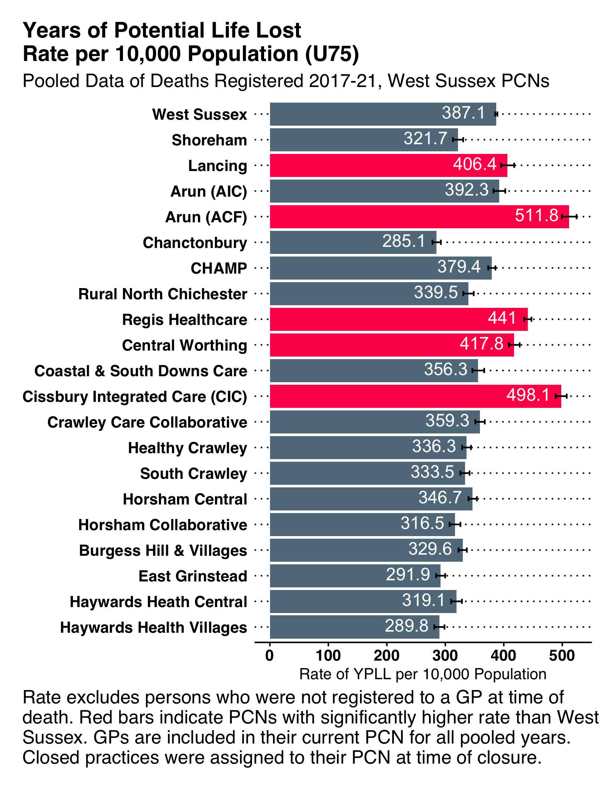
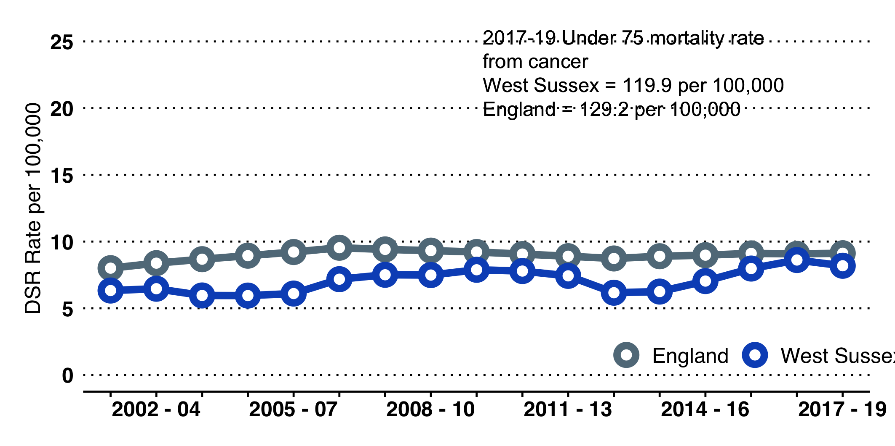
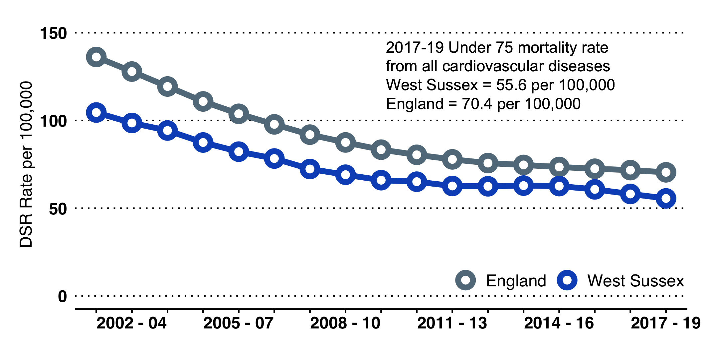

#### Contacts and Further Information

This report was drafted by the West Sussex Public Health and Social
Research Team with support from colleagues from across the council and
local organisations.

#### JSNA Website

We place full reports, information and links on the West Sussex JSNA
website. <https://jsna.westsussex.gov.uk/>

#### Posters available

We are keen to disseminate the information from the JSNA. For some
subjects we have drafted posters which can be downloaded from the
website.

#### West Sussex Life

The current version of West Sussex Life can be found on the West Sussex
website. (<https://www.westsussex.gov.uk/campaigns/west-sussex-life/>)

# Introduction

::: tcolorbox
## What is a JSNA?

The West Sussex Joint Strategic Needs Assessment (JSNA) sets out the
health and wellbeing needs of the population of West Sussex. It is not a
single document or piece of analysis but encompasses a range of work,
including detailed needs assessments relating to specific subjects or
communities, evaluations of new programmes or activities, local surveys,
and a range of briefings and ad hoc analyses. **This summary is a brief
run-through of the data available.**
:::

#### Scale, Direction and Significance

Being presented with a lot of facts and figures can be overwhelming. We
recommend keeping three things in mind when assessing quantitative data:

-   Develop a clear understanding of the **SCALE** of an issue in
    understanding population level needs. *F*or example, in West Sussex
    there are approximately 160-200 teenage pregnancies in a year.

-   Look at the trend or **DIRECTION** - if you have a good time series
    of data, look at the short, medium and long term. *F*or example, in
    relation to teenage pregnancy, there is a long downward trend
    locally and nationally.

-   Finally, look at **SIGNIFICANCE** - is one year different to the
    next, or one place compared with another? In this summary we use the
    term significant to mean *statistically* significant (meaning a
    difference that isn't due to random chance). *For example, locally
    there was a rise in teenage pregnancy between 2016 and 2017 but this
    was small and not significant.*

::: tcolorbox
Data in this summary are compared in a number of ways: over time,
between different groups in the population, or by area. We frequently
compare information with England and with \"comparable local
authorities\". The Chartered Institute of Public Finance and Accounting
(CIPFA) group local authorities by looking at population characteristics
(such as population, socioeconomic indicators, household and mortality
characteristics).

For West Sussex our current (January 2020) comparable authorities are:

::: multicols
3

-   Cambridgeshire

-   Devon

-   East Sussex

-   Essex

-   Gloucestershire

-   Hampshire

-   Kent

-   North Yorkshire

-   Northamptonshire

-   Oxfordshire

-   Somerset

-   Staffordshire

-   Suffolk

-   Warwickshire

-   Worcestershire
:::
:::

## West Sussex Health and Wellbeing Strategy Priorities 2019-2024

One of the key functions of the JSNA is to inform the local Health and
Wellbeing Strategy. Past JSNA summariesm have informed the **West Sussex
Health and Wellbeing Strategy 2019-2024**. The Strategy adopts a
lifecourse approach.

Following consultation and wider engagement, the West Sussex Health and
Wellbeing Board board identified priorities across three themes -
Starting Well, Living and Working Well and Ageing well.

### Start Well Priorities

-   Improved mother and baby health and wellbeing, especially for those
    in most need

-   Children growing in a safe & healthy home environment with
    supporting and nurturing parents and carers

-   Good mental health for all children

-   Children and young people leaving care are healthy and independent

### Live Well Priorities

-   Individuals, families, friends and communities are connected

-   People have access to good quality homes providing a secure place to
    thrive and promote good health, wellbeing and independent living

-   People are able to look after their own health

-   People live, work and play in environments that promote health and
    wellbeing

### Age Well Priorities

-   Fewer older people feel lonely or socially isolated

-   There is a reduction in the number of older people having falls

-   Older adults stay healthier, happier and independent for longer

-   People receive good quality end of life care and have a good death

Partly in response to the priorities set out in the strategy, we have
undertaken some focussed and more detailed analysis including detailing
social mobility and multiple deprivation, mental health and wellbeing,
emergency admissions, falls, self-care and self-management.

## Impact of Covid-19 on Public Health Outcomes

The Office of Health inequalities and disparities (OHID) have identified
a number of existing Fingertips indicators that can be used to
demonstrate the onging effects of Covid on population health in West
Sussex.
Figure [\[fig:covid-impacts\]](#fig:covid-impacts){reference-type="ref"
reference="fig:covid-impacts"} shows these indicators and the impact
that Covid-19 has had and will continue to have across the life course.

::: table*
::: tabular
\@M4mmM26mmM30mmM30mmM30mmM80mmM26mm@  & **Pregnancy** & **Infancy** &
**Childhood** & **Adolescence** & **Adulthood** & **Elderly**\
& Reduced antenatal care & Perinatal mental health & 'Hidden'
safeguarding issues & Increased negative health behaviours & Increased
negative health behaviours (e.g. substance misuse, alcohol, smoking,
gambling, inactivity) & Social isolation and loneliness\
 & Perinatal mental health & Breastfeeding support & Developmental and
mental health checks not completed & Deferred sexual health services &
Paused commissioned lifestyle services, deferred cancer screening/NHS
health checks, reduced health seeking for urgent issues, 'hidden'
safeguarding issues & Limited physical activity\
 &  & Immunisation uptake& Adverse childhood experiences & Low mood and
high anxiety & Economic uncertainty &  \
 &  & Non-accidental injuries &  &  & New anxiety and worsening existing
mental illness, PTSD for carers/health workers and families &  \
(r)2-7 & Safeguarding risks & Unplanned pregnancies & Adverse childhood
experiences & Increased demand for mental health services & Fewer
recovering from substance misuse, increased BBV infections, adults
smoking, adults overweight/obese & Dementia diagosis\
 & Risky behaviours (Smoking, alcohol, substance misuse) & Admissions
for gastrointestinal and respiratory infections &  & Unwanted
pregnancies & Cancer screening coverage (breast, cervical, bowel) and
late presentation & Injuries due to falls\
 &  & Population vaccination coverage reduced and outbreaks& & STI
diagnoses & Increased demand for grief and bereavement services,
employment/training support, claiming out of work benefits & Fuel
poverty\
 &  &  &  &  & People with high anxiety&  \
(r)2-7 & Low birthweight & Higher risk of poor mental health and
physical health & School readiness & Alcohol and substance misuse
admissions under 18s & Increased demand for mental health services &
Increased morbidity and mortality\
 & Poor attachment & Higher risk of poor social and educational outcomes
&  & Obese children & Under 75s mortality from cardiovascular and liver
disease and cancer &  \
 & Admissions for deliberate or intentional harm &  &  & Admissions for
self harm & Worsening social inequalities &  \
 & Smoking at time of delivery &  &  &  & Suicide&  \
:::
:::

## West Sussex in Outline

The population of West Sussex is approx 867,600 and has increased by 2%
over the last 5 years. This is broadly in line with increases seen at a
national and regional level, with the largest increase, of over 6%, in
the 65+ age group.

The population in West Sussex is projected[^1] to increase by a further
8% from 2021 to 2031 with larger increases projected in the 65+ age
group (23%+) and notably in the 85+ age group (28%), in the same 10 year
period.

There are over 325 schools; 83 GP practices grouped into 19 Primary Care
Networks (PCN); 160 community pharmacies; hospitals with A&E departments
at Chichester and Worthing, and additional NHS hospital sites across the
county; 36 libraries; and numerous museums, galleries, theatres and
historic properties.

West Sussex has a large number and variety of organisations, groups and
associations that are fundamental in the delivery of services that
support health and wellbeing; these support individuals, families and
communities, and enhance the vibrancy and quality of life in the county.

Overall, in West Sussex, people enjoy a good quality of life, and have a
longer life expectancy when compared with England; life expectancy for
men is 80.3 years and 83.9 years for women (2020). However the average
in West Sussex masks considerable inequality, and differences between
areas and between different groups within the population. **Some
neighbourhoods in Arun and Crawley now rank amongst the poorest 10% of
all areas in England**, and there remain considerable differences
between the life expectancy of the wider population and people with
mental health problems and those with disabilities, including learning
disabilities.

### West Sussex as Home

**Although home ownership rates are high, West Sussex is an increasingly
costly place to live.** The ratio of lower quartile[^2] house prices to
lower quartile earnings stands at 11:1 in Worthing, and over 14:1 in
Chichester (2021).

Rents have also been increasing, with median rent at £900 per month
across West Sussex overall (October 2020 to September 2021), and ranging
from £830 in Arun to £1050 in Horsham.

In 2020/21 there were almost 8,600 households on council waiting lists
in West Sussex.[^3]

-   **448 households were accepted as homeless and in priority need.**

-   **114 households with one or more dependent children** were accepted
    as homeless and in priority need (subset of the above).

-   **395 households were recognised as homeless but not in priority
    need**[^4].

-   **1,138 households[^5] and 999 children were in temporary
    accommodation.** 291 of these were in Crawley and 186 in Arun.

-   **Over 27,000 households claimed Housing Benefit**, a third of which
    were in private rented accommodation.

**Estimates of the number of people who are rough sleeping need to be
treated with some caution**; rough sleeping is notoriously difficult to
count and numbers fluctuate. As a broad estimate, in 2021 there were an
estimated 58 rough sleepers in West Sussex[^6].

## Protected characteristics

The Equality Act 2010 consolidated and replaced previous legislation in
a Single Act. Public bodies must have due regard to: eliminate
discrimination advance equality of opportunity foster good relations
between different people when carrying out their activities There are
nine protected characteristics; it is against the law to discriminate
against someone because of a protected characteristic. A high level
description of protected characteristics in West Sussex is shown, with
the key source used. Data are collected from a wide range of surveys and
services. The ONS undertake regular audits of data sources for different
purposes (for example work, health, education etc). This looks at data
on protected characteristics and some of the vulnerable groups listed
below.

::: tcolorbox
Overall, West Sussex has an older population compared with England. In
2020, 24% of the population (204,500 people) were aged 65 years or over,
compared with 18% nationally. A notable exception below county level is
Crawley, where less than 14% of the population is 65+ years and 22% are
aged 0-15 years. [^7]
:::

::: tcolorbox
51% of the West Sussex population is female, reflecting the longer life
expectancy of women. In the older age groups the gap is greater, with
55% of 65+ year-olds and 63% of 85+ year-olds being female. [^8]
:::

::: tcolorbox
Under the Act, a person has a disability if they have physical or mental
impairment which has a substantial and long-term adverse effect on that
person's ability to carry out normal day-to-day activities. There is a
strong relationship with age. Using data from a national survey, this
equates to 21% of the total population, ranging from 3% of 0-4 year-olds
to 60% of people aged 80+ years.[^9]
:::

::: tcolorbox
Data are collected across organisations and services, although
completion is often poor. Population level data are available from the
Census. In 2011, 89% of the county population were White British, higher
than England (80%). Crawley is, again, notably different from the rest
of the county, with 72% White British and 5.2% and 4.3% from Indian and
Pakistani backgrounds respectively.[^10]
:::

::: tcolorbox
Data on religion are collected infrequently and the census (where the
question was voluntary) remains the most comprehensive source. 66% of
people stated they had a religious belief in West Sussex (lower than
England - 68%). Crawley had a higher percentage of people who stated
their religion as Hindu (5%) or Muslim (7.5%).[^11]
:::

::: tcolorbox
Data are collected infrequently, usually as part of national surveys
such as the Annual Population Survey. In 2020, ONS estimated that 3.1%
of the UK population aged 16 years and over identified as lesbian, gay
or bisexual (LGB) in 2020, an increase from 2.7% in 2019 and almost
double the percentage from 2014 (1.6%). Using this assumption, this
represents 22,000 people aged 16+ in West Sussex.[^12]
:::

::: tcolorbox
There is an absence of reliable data at a national or local level
relating to the number of people who have/are seeking gender
re-assignment or identify with a different gender than they were
assigned at birth. Nationally the Government have stated a tentative
estimate of 200,000 to 500,000 people broadly described as
transgender.[^13]
:::

::: tcolorbox
Data are published regularly by the ONS, using data collected from
Registrars, but this information is not broken down into sub-national
areas. The Census 2011 described the marital/civil partnership status of
residents. In West Sussex, 51% of people aged 16+ were married or in
civil relationships, 29% single, 10% divorced, 8% widowed, and 2%
separated. [^14]
:::

::: tcolorbox
Various data are available but often at NHS maternity system level, NHS
provider level, or relating to births as opposed to mothers or
maternities. In West Sussex, in 2020, there were 8,001 births, 29 of
which were to mothers aged 18 years or under. [^15]
:::

### Other vulnerable groups in the population

Although not covered by the Equality Act, it is important to recognise
that there are other groups in the population which are at known higher
risk of poorer health and wellbeing outcomes. These include:

-   Carers (notably those caring for 50+ hours a week)

-   People living in poverty

-   Homeless people

-   Children in care or leaving care

-   Military veterans (notably younger veterans leaving service early)

-   Gypsy, traveller and show people

-   Refugees, asylum seekers or undocumented, forced, smuggled or
    trafficked migrants

-   People in detention

## Population estimates

Table [\[tab:population\]](#tab:population){reference-type="ref"
reference="tab:population"} on page  shows the population estimates by
age group for West Sussex from 2011 to 2020. These are ONS Mid-Year
Estimates, which are published every year (usually in June). On the same
table we have included the ONS Sub-National Population projections for
the years 2021 to 2025.

**Note:** WSCC also produce population projections which incorporate
local information on housing development. The ONS projections have been
used to provide a strategic level summary of population change. *All
data are rounded to the nearest 100.*

::: table*
::: centerbox
::: threeparttable
::: tabular
l l l l l l l l l l l

& & & & & & & & & &

& & & & & & & & & &

& & & & & & & & & &

& & & & & & & & & &

& & & & & & & & & &

& & & & & & & & & &

& & & & & & & & & &

& & & & & & & & & &

& & & & & & & & & &

& & & & & & & & & &

& & & & & & & & & &

& & & & & & & & & &

& & & & & & & & & &

& & & & & & & & & &

& & & & & & & & & &

& & & & & & & & & &

& & & & & & & & & &

& & & & & & & & & &

& & & & & & & & & &

& & & & & & & & & &
:::
:::
:::
:::

## Natural Assets

**West Sussex is a large and diverse county, covering over 750 square
miles.**

The West Sussex environment, natural and built, is a great asset, with
historic coastal resorts, seaside attractions, beautiful countryside and
lively market towns and villages. Places in West Sussex frequently
feature in the national press as highly desirable places to live, work
or retire. A large part of the county is within the South Downs National
Park.

The natural environment has a big impact on our physical and mental
wellbeing, so maximising health benefits of the West Sussex environment
is important.

However when surveyed, **only 20% of West Sussex residents said that, in
the previous week, they had utilised the outdoors for health
reasons[^16].** We also know that people in poorer health, people with a
disability and people from more deprived communities are less likely to
utilise the outdoors for recreational and health purposes.

Nationally, walking, in terms of frequency and distance, is declining,
with some increase in the level of cycling. Wherever possible,
incorporating exercise into the daily routine, including walking or
cycling as part of the journey to work, is a good way to maintain
physical activity levels. **In West Sussex, 16.6% of adults walk at
least 5 times a week[^17]** for \"travel purposes\"[^18] such as walking
to work, but this ranges from 19% of adults in Mid Sussex and Worthing,
down to 14% in Arun. 68% of adults walk for leisure at least once a
month.

**At present there are ten Air Quality Management Areas (AQMA) in West
Sussex.** This includes three separate AQMAs within the city of
Chichester. All relate to annual exceedance of $\mathsf{NO_2}$ and all
cite road transport as the source of pollution. Arun is the only
district within West Sussex without an AQMA (as of December 2019). In
2020, 5.8% of all mortality in West Sussex was estimated to be
attributable to anthropogenic particulate air pollution[^19].

### Healthy Environments -- The Access to Health and Hazards Index

The environments in which we live, work, shop and travel etc. impact our
health; they can act to promote good health or can adversely affect our
health and restrict the choices we make.

Providing a summary measure of how healthy an environment is is
challenging; areas may have positive attributes alongside negative ones.
Rural areas, for example, may provide good access to green spaces but
have poorer access to health services. Providing a summary value at a
local authority level is also problematic, as we experience environments
at a localised/neighbourhood level.

The Access to Healthy Assets and Hazards (AHAH) is an index which ranks
neighbourhoods (at Lower Super Output Area) on four domains:

1.  **access to retail services** (fast food outlets, gambling outlets,
    pubs, bars, nightclubs, off licences, tobacconists)

2.  **access to health services** (GP surgeries, A&E hospitals,
    pharmacies, dentists and leisure centres)

3.  **the physical environment** (Blue Space, Green Space - Active,
    Green Space - Passive)

4.  **and air pollution** (NO2 level, PM10 level, S02 level).

The Consumer Data Research Centre have produced very accessible outputs
at neighbourhood level.

Data are freely accessible in map form <http://maps.cdrc.ac.uk/>. AHAH
and data behind the maps can be downloaded from the same website.

## Poverty

### Poverty and Poor Health

We know that people from lower income groups are more likely to be in
poorer health and more likely to have a limiting long term illness and
lower life expectancy.

**On average in West Sussex, men in the most deprived areas die almost 7
years earlier than men in the least deprived areas; women in the most
deprived areas die 6 years earlier than their least deprived
counterparts[^20].**

The relationship between poverty and poor health is a complex one. Being
in poor health, having a disability or being a carer can affect your
ability to get or maintain a job.

People in poorer health or who have a disability may also face higher
living costs, such as higher transports costs, heating costs or costs to
access specialist provision e.g. specialist child care or equipment.

### Income Deprivation in West Sussex

Tables [\[tab:incomedep:popn\]](#tab:incomedep:popn){reference-type="ref"
reference="tab:incomedep:popn"},
[\[tab:incomedep:kids\]](#tab:incomedep:kids){reference-type="ref"
reference="tab:incomedep:kids"}, and
[3](#tab:incomedep:oaps){reference-type="ref"
reference="tab:incomedep:oaps"} are calculated from data published in
the Index of Deprivation 2019. Note that these measure low income for
people who are out-of-work and those in work but on low earnings (and
who satisfy the respective means tests). The individual totals are
derived from the sum of the 7 non-overlapping welfare benefits.[^21]

::: {#tab:incomedep:oaps}
                Number   Percentage
  ------------- -------- ------------
  Adur          6,800    10.8
  Arun          16,100   10.4
  Chichester    9,300    7.9
  Crawley       12,200   11.0
  Horsham       7,600    5.6
  Mid Sussex    7,800    5.3
  Worthing      10,900   10.1
  West Sussex   70,700   8.4

  : The proportion of all those AGED 60 YEARS OR OVER who experience
  income deprivation.
:::

::: {#tab:incomedep:oaps}
                Number   Percentage
  ------------- -------- ------------
  Adur          1,600    14.3
  Arun          3,400    13.6
  Chichester    2,100    10.7
  Crawley       3,700    15.6
  Horsham       1,700    6.6
  Mid Sussex    1,800    6.5
  Worthing      2,400    12.5
  West Sussex   16,700   11.0

  : The proportion of all those AGED 60 YEARS OR OVER who experience
  income deprivation.
:::

::: {#tab:incomedep:oaps}
                Number   Percentage
  ------------- -------- ------------
  Adur          2,200    11.8
  Arun          5,800    10.8
  Chichester    3,200    8.2
  Crawley       2,700    13.7
  Horsham       2,500    6.6
  Mid Sussex    2,600    6.8
  Worthing      3,400    11.5
  West Sussex   22,400   9.5

  : The proportion of all those AGED 60 YEARS OR OVER who experience
  income deprivation.
:::

## Inequality in life expectancy

Overall, life expectancy has increased in West Sussex and remains higher
for both men and women compared to the life expectancy in England.
However, there remain considerable differences in life expectancy
between males and females[^22] and between people from the most deprived
and least deprived areas[^23].

{width="\\linewidth"}
{width="\\linewidth"}
[]{#fig:life_exp label="fig:life_exp"}

Difference in years of life expectancy between the least deprived and
most deprived areas in West Sussex (2017-2019): Males from the most
deprived area live on average 7 years fewer than males from the least
deprived areas. Females from the most deprived areas live on average 6
years fewer than females from the least deprived areas.

For both men and women, circulatory causes (including stroke and heart
disease) account for approximately a quarter of the difference, with
cancers a further fifth of the difference[^24].

{width="\\linewidth"}
{width="\\linewidth"}
[]{#fig:life_exp_gap label="fig:life_exp_gap"}

Respiratory includes flu, pneumonia, and chronic obstructive respiratory
disease. Digestive includes alcohol-related conditions such as chronic
liver disease and cirrhosis. External includes deaths from injury,
poisoning and suicide. Mental and behavioural includes dementia and
Alzheimer's disease. Percentages may not sum to 100 due to rounding.

PHE publish a segmentation tool to examine differences in life
expectancy. Data are available at lower tier LA level
<https://connect.healthdatainsight.org.uk/health_inequalities/segment_tool/>.

# Starting Well

## Summary

**The early years of life lay foundations for lifelong physical,
emotional and mental health, wellbeing and resilience. In tackling
inequalities, action taken in the early years of life can have lifelong
benefit, with many interventions being highly cost-effective.**

There are 193,200 children and young people aged 0-19 years in West
Sussex, with approximately 8,000 births a year. Across the county
overall, 22% of the population are 0-19 years, which is lower compared
with England (24%). Within the county, Crawley has a much younger
population, with 26% of residents aged 0-19 years.

Overall measures of infant and maternal health in West Sussex are good,
but inequalities are apparent across the county and in relation to
specific groups.

-   The infant mortality rate remains below the national rate (3.6 per
    1,000 live births compared with 3.9 nationally)[^25], we have fewer
    low birth weight babies, a lower percentage of women who smoke at
    the time of delivery, and a higher proportion of children who are
    assessed as having a good level of development at their two year
    check.

However there remain challenges in the early years of life.

-   Many immunisation rates, whilst higher than national levels, remain
    below target levels.

-   Measures relating to child readiness for school have improved in
    recent years but remain lower than many comparable authorities and
    for children eligible for a free school meal. For example, in
    2018/19, approximately 72% of children achieved a good level of
    development at the end of Reception whilst only 51% were assessed as
    having a good level of development, the third lowest of comparable
    authorities.

We continue to observe a strong social gradient across many indicators
and outcomes. Children living in poverty and from deprived areas are
more likely to be overweight or obese; less likely to attain the
expected level of attainment across educational key stages; more likely
to admitted to hospital for self-harm; more likely to become pregnant as
a teenager; and more likely to grow up in a household where someone
smokes.

In West Sussex, almost 17,000 children live in poverty. Children in
poverty are more likely to come from single parent/carer families, be
disabled or live in a household with an adult who is disabled. Poverty
can transmit across generations and there are specific concerns about
low social mobility in some parts of the county.

It is also important to recognise that, on average, children who are in
care or are care leavers have significantly poorer health and
educational outcomes than their peers.

Emotional and mental health are instrinically linked to physical
wellbeing and longer term outcomes. Children who are happier and more
emotionally resilient tend to have better physical health. Local survey
data has highlighted the importance of cognitive reappriasal (reframing
problems in a positive way) and expressive suppression (burying negative
feelings/avoidance) in predicting life satisfaction and overall
happiness[^26].

## Infant and Maternal Health

Key demographic information and health indicators are summarised in the
West Sussex Local Health Profiles for Children and Young People 2020,
available on the JSNA website.

### Infant and Maternal Health

**In 2020 there were 8,001 births,** the lowest number in West Sussex
since 2006. The infant mortality rate[^27] in 2018-2020 was 3.6 per
1,000 live births, lower than the national rate of 3.9 per 1,000,
although a slight increase on the previous three years.

The **neonatal mortality rate** (defined as the number of deaths under
28 days, per 1,000 live births) has remained stable over the past 10
years, although there has been a slight rise in both 2017-2019 and
2018-2020. The rate in West Sussex 3.6 per 1,000 live births, in line
with the England rate (3.9 per 1,000) and below the median of the south
east region.

**The percentage of term babies with low birth weight (less than 2500g;
[^28]) remains steady**, at 2.04% in 2020, and significantly lower than
England (2.9%) and in the lowest three of CIPFA neighbours.

In 2018-20, there were **78.6 premature births (less than 37 weeks
gestation) per 1,000** live births and still births, which is the lowest
it has been since 2011-13 (76.6 per 1,000). The rate in West Sussex has
followed national trends, and is in line with the England rate of 79.1
per 1,000.

The multiple birth rate (the number of maternities with multiple births
per 1,000 total maternities) in 2020 was 11.0 (**87 multiple births**),
lower than the England rate of 14.4.

**In 2020/21, 34.1% of births were by caesarean section in West
Sussex.** This proportion has been increasing over the last 5 years and
is significantly higher compared to England (32.5%) and is also the
second highest among five comparable authorities[^29].

**The percentage of women smoking at the time of delivery[^30] remained
low in 2020/21 at 8.5% (approximately 678 maternities)**, lower than the
national rate and the second lowest of comparable authorities.

In 2019/20, 55.7% of women breastfed (wholly or partly) at 6-8
weeks[^31]. Nationally, the figure was 48%. West Sussex was the second
highest of comparable authorities. Note that this indicator is not
available for 2020/21 due to data quality issues.

In 2020/21, 91.5% of New Birth Visits (NBVs)[^32] were completed within
14 days this has increased to be above the England rate (88.0%).

In 2020/21, 84% of children assessed achieved a good level of
development at 2-2½ years[^33], comparing well with England (82.9%), and
making West Sussex the fifth highest amongst comparable local
authorities.

Uptake of the flu vaccine in 2-3 year-olds[^34] in 2020/21 was 67.5% and
was significantly higher than England (56.7%) and the
$\geq$`<!-- -->`{=html}65% benchmark.

### Maternal Mental Health

In relation to maternal mental health, it is estimated that between 10%
and 20% of women will be affected by mental health problems, either
during their pregnancy or in the first year post delivery. Local data
are scarce but using synthetic estimates provided by Public Health
England, the number of mothers with specific problems are shown below
(note some women will be affected by one or more problems):

-   Postpartum psychosis: 20

-   Chronic Severe Mental Illness: 20

-   Severe depressive illness: 250

-   Mild-moderate depressive illness and anxiety: 830 (lower estimate)
    to 1,245 (upper estimate)

-   PTSD: 250

-   Adjustment disorders and distress: 1,245 (lower estimate) to 2,485
    (upper estimate)

## West Sussex Childhood Vaccine and Immunisation Coverage Rates

See
Table [\[tab:childhoodimms\]](#tab:childhoodimms){reference-type="ref"
reference="tab:childhoodimms"} on page .

::: table*
  Immunisation          Detail                                                                                                                            Year   \% Coverage   Lower CI   Upper CI
  --------------------- ---------------------------------------------------------------------------------------------------------------------------- --------- ------------- ---------- ----------
  Hepatitis B           \% of children at age 12 months who have received the complete course (3 doses) of hepatitis B vaccine                         2020/21         87.5%      52.9%      97.8%
  DTaP / IPV / Hib      \% of children who received 3 doses of DTaP/IPV/Hib vaccine at any time by their first birthday                                2020/21         95.5%      95.0%      95.9%
  MenB                  \% of children who received the MenB vaccine at any time before their first birthday                                           2020/21         95.8%      95.3%      96.2%
  Rotavirus             \% of children who have received the rotavirus vaccine by 6 months of age                                                      2020/21         93.3%      92.7%      93.8%
  PCV                   \% of children who received two doses of PCV at any time before their first birthday                                           2019/20         95.8%      95.3%      96.2%
  Hepatitis B           \% of children at age 24 months who have received the complete course (4 doses) of hepatitis B vaccine                         2020/21         66.7%      39.1%      86.2%
  DTaP / IPV / Hib      \% of children who received 3 doses of DTaP/IPV/Hib at any time before their 2nd birthday                                      2020/21         96.1%      95.7%      96.5%
  MenB booster          \% of children who received a booster dose of MenB at any time before their 2nd birthday                                       2020/21         94.0%      93.5%      94.5%
  MMR one dose          \% of children who received one dose of MMR on or after their first birthday and at any time before their 2nd birthday         2020/21         94.5%      94.0%      95.0%
  PCV booster           \% of children who received a booster dose of PCV at any time before their 2nd birthday                                        2020/21         94.6%      94.1%      95.0%
  Flu                   \% of children aged 2-3 years old, who received the Flu vaccination (1st Sept to the end of Feb) in a primary care setting     2020/21         67.5%      66.8%      67.3%
  Hib / Men C booster   \% of children who received a booster dose of Hib/MenC at any time before their fifth birthday                                 2020/21         94.6%      94.1%      95.0%
  DTaP / PPV            \% of children who received a booster dose of DTaP/PPV at any time before their fifth birthday                                 2020/21        91.40%      90.8%      91.9%
  MMR for one dose      \% of children who received one dose of MMR on or after their first birthday and at any time before their fifth birthday       2020/21         96.1%      95.8%      96.5%
  MMR for two doses     \% of children who received two doses of MMR on or after their first birthday and at any time before their fifth birthday      2020/21         93.0%      92.4%      93.4%
  Flu                   \% of primary school aged children from reception to year 6 age receiving the flu vaccine                                      2020/21         67.0%      66.6%      67.3%
  HPV - one dose        \% of females in school year 8 (aged 12-13) who have received the first dose of HPV vaccine                                    2019/20         14.9%      13.9%      15.9%
  HPV - one dose        \% of males in school year 8 (aged 12-13) who have received the first dose of HPV vaccine                                      2019/20         10.7%       9.9%      11.6%
  HPV - two doses       \% of females in school year 8/9 (aged 13-14) who have received the second (completing) dose of HPV vaccine                    2019/20         11.3%      10.4%      12.3%
  Men ACWY              \% of 14-15 year olds (Year 9/10) receiving the Meningococcal ACWY conjugate vaccine                                           2019/20         87.9%      87.2%      88.5%

[]{#tab:childhoodimms label="tab:childhoodimms"}
:::

## Hospital admissions

#### Emergency admissions

In 2020/21, West Sussex had among the highest emergency hospital
admission rates in the South East, and rates were higher than national
rates:

-   **Under 1 years old -- 2,500 admissions,** a rate of 253.4 per 1,000
    population.

-   **0-4 year olds -- 4,880 admissions,** a rate of 107.4 per 1,000
    population.

-   **Under 18s -- 9,480 admissions,** a rate of 53.4 per 1,000
    population.

#### Admissions to hospital - 0-19 year olds

-   **Asthma -- 100 admissions (2020/21)**, a rate of 53.8 per 100,000
    population, lower than England and comparable authorities.

-   **Diabetes -- 115 admissions (2019/20)**, a rate of 62.2 per 100,000
    higher than England and comparable authorities.

-   **Epilepsy -- 125 admissions (2019/20)**, a rate of 67.6 per
    100,000, similar to England and comparable authorities.

## Disability through the life course

#### Overall Disability Assumption

The term \"disability\" is frequently used but often poorly defined, and
estimating the prevalence and type of disability within a population is
difficult. The purpose of a definition (for example, for deciding
educational support vs. eligibility for welfare benefits), as opposed to
a \"formal diagnosis\" can mean that different sources can often provide
very different pictures of the local population.

The Family Resources Survey (FRS) is a national, continuous household
survey that collects data on a wide range of information including
disability[^35], caring, tenure and income. One of the main functions of
the survey is to inform the Department of Work and Pensions (DWP) of the
living conditions and economic circumstances of different households.
Small sample size means that data are not published below regional
level. Using the results from the latest national survey and applying
the prevalence to the local population provides a local estimate of
disability by age groups. Given that West Sussex overall has a
relatively healthy and wealthy population, these estimates may be higher
than expected and should be treated as possibly high estimates.

{width="\\linewidth"}
[]{#fig:frs_diab_wsx label="fig:frs_diab_wsx"}

#### FRS Type of Impairment

Of people who described themselves as being disabled, data were also
collected on the nature of their impairment. As people are able to state
multiple impairments, figures in
Table [4](#tab:impairment){reference-type="ref"
reference="tab:impairment"} do not sum 100.

Nationally it is noted that the proportion of FRS respondents who
reported a mental health impairment has been rising in recent years,
from 22% in 2015/16 to 25% in 2017/18.

Note again that, given West Sussex overall has a relatively healthy and
wealthy population, these estimates may be higher than expected and
should be treated as possibly high estimates.

::: {#tab:impairment}
  ------------------------------ -------------- ---------- --------- ---------
  Impairment                     All Disabled   Children   Working   State
  type (%)                       People                    age       Pension
  Mobility                       49             19         41        67
  Stamina, breathing & fatigue   37             24         32        46
  Dexterity                      26             11         23        34
  Mental health                  25             23         38        9
  Memory                         16             11         16        17
  Hearing                        14             8          8         23
  Vision                         12             9          9         18
  Learning                       13             36         14        8
  Social/behavioural             9              43         10        2
  Other                          17             18         18        15
  ------------------------------ -------------- ---------- --------- ---------

  : FRS Type of Impairment
:::

[]{#tab:impairment label="tab:impairment"}

## Mental Health and Wellbeing

**Major national surveys remain the best source of evidence on the
prevalence of mental health disorders among children and young people.**

In 2004, ONS conducted a national survey to estimate the prevalence of
mental health conditions in children aged 5-16[^36]. Public Health
England has applied the survey results to local populations taking into
account age, sex and socio-economic classification[^37]. In 2015, 8.4%
of children and young people aged 5-16 were estimated to have a mental
health condition in West Sussex. This equates to around 9,500 children.
Since there is evidence to suggest that prevalence of mental health
conditions among children and young people has increased, it is possible
that this represents an underestimate.

::: {#tab:yp:mh1}
  --------------- ---------------------- ---------------
  Type of         Estimated 2015           Number of CYP
  disorder        prevalence among CYP                  
  Mental health   8.4%                             9,490
  Emotional       3.2%                             3,655
  Conduct         5.0%                             5,635
  Hyperkinetic    1.3%                             1,515
  --------------- ---------------------- ---------------

  : Estimates from the 2004 Survey applied to 2015 Population
:::

[]{#tab:yp:mh1 label="tab:yp:mh1"}

The 2004 survey has now been updated with a new series of data
collection completed in 2017[^38]. NHS Digital released the findings
from this survey in 2019. This goes beyond the 2004 survey, providing
estimates of the prevalence of mental health disorder in 2 to 4 year
olds, and spans the transition into adulthood covered by 17 to 19 year
olds.

The main findings from the 2017 survey include:

-   **One in eight (12.8%) 5 to 19 year olds and one in eighteen (5.5%)
    preschool children assessed had at least one mental health
    disorder**

-   **Rates of mental health disorders increased with age.** Young
    people aged 17 to 19 were three times more likely to have a mental
    health disorder (16.9%) than preschool children aged 2 to 4 (5.5%),
    although data collection methods varied by age

-   **Young women were identified as a high a risk group in relation to
    mental health,** with nearly one in four (23.9%) 17 to 19 year old
    girls identified as having a mental disorder

-   **Prevalence of mental disorders also varied by ethnicity** (higher
    in White British children) and by socioeconomic status (higher among
    children living in lower income households)

-   **Emotional disorders were the most prevalent type of disorder
    experienced** by 5 to 19 year olds in 2017 (8.1%)

-   **Behavioural disorders were the most prevalent (2.5%) for preschool
    children**

-   **Trend analyses revealed a slight increase over time in the
    prevalence of mental disorder** in 5 to 15 year olds

-   **Emotional disorders have become more common in 5 to 15
    year-olds,** whilst prevalence of other mental health disorders have
    remained similar over time

-   **Most children with a disorder who had used professional services
    tended to view them as helpful.** Primary care was the service most
    likely to be rated as unhelpful; 17.0% of 5 to 19 a year olds with a
    disorder who had contact with a primary care a professional due to
    worries about mental health described the contact as unhelpful or
    very unhelpful.

#### Wave 2 follow up to the 2017 survey

Published in September 2021, the wave 2 follow up to the 2017
survey[^39] examined the mental health of 6 to 23 year olds living in
England in 2021 and describes their experiences of family life,
education, and services during the coronavirus (COVID-19) pandemic.
Comparisons were made between 2017 and 2020 (where possible), to monitor
changes over time.

The key findings were:

-   Probable mental disorder: Rates of probable mental disorder
    increased between 2017 and 2021; in 6 to 16 year olds from one in
    nine (11.6%) to one in six (17.4%), and in 17 to 19 year olds from
    one in ten (10.1%) to one in six (17.4%). Rates in both age groups
    remained similar between 2020 and 2021.

-   Change in mental health: Looking at individual-level change, 39.2%
    of those aged 6 to 16 years in 2021 had experienced deterioration in
    mental health since 2017, and 21.8% experienced improvement. Among
    those aged 17 to 23 years in 2021, 52.5% experienced deterioration,
    and 15.% experienced improvement.

-   Eating problems: The proportion of children and young people with
    possible eating problems increased between 2017 and 2021, from 6.7%
    to 13.0% in 11 to 16 year olds and from 44.6% to 58.2% in 17 to 19
    year olds.

-   Sleep problems: In 2021, problems with sleep on three or more nights
    of the previous seven affected over a quarter (28.7%) of 6 to 10
    year olds, over a third (38.4%) of 11 to 16 year olds, and over half
    (57.1%) of 17 to 23 year olds. Across all age groups figures were
    much higher in those with a probable mental disorder (59.5%, 74.2%,
    86.7% respectively).

-   School absence: Overall, 10.6% of 6 to 16 year olds missed more than
    15 days of school during the 2020 Autumn term. Children with a
    probable mental disorder were twice as likely to have missed this
    much school (18.2%) as those unlikely to have a mental disorder
    (8.8%).

-   Learning resources: The proportion of 6 to 16 year olds with a
    laptop or tablet they could work on at home, increased from 89.0% in
    2020 to 94.4% in 2021. The proportion receiving regular support from
    school or college also increased, from 73.7% in 2020 to 79.9% in
    2021.

#### Estimated prevalence by CAMHS \"Tier\" in West Sussex

Mental health services are often described in terms of tiers, where
services become more specialised, from emotional wellbeing services at
Tier 1 to highly specialist outpatient teams and inpatient provision at
Tier 4. Prevalence estimates (population aged 17 and under) based on
findings published in \"Treating Children Well\"[^40] are shown in
Table [6](#tab:yp:camhs-tiers){reference-type="ref"
reference="tab:yp:camhs-tiers"} against each of the tiers. These provide
an estimate of the number of West Sussex children and young people who
may at any one time, need a service response or support.

::: {#tab:yp:camhs-tiers}
  ---------------- ------------ ------------------
  Tier - service     Prevalence   Estimated number
  provision          assumption        of children
  Tier 4                 0.075%                130
  Tier 3                  1.85%              3,230
  Tier 2                  7.00%             12,225
  Tier 1                 15.00%             26,200
  ---------------- ------------ ------------------

  : Estimated prevalence by CAMHS tier
:::

[]{#tab:yp:camhs-tiers label="tab:yp:camhs-tiers"}

## Autism

There are a number of problems estimating the number of people who have
autism:

-   There is no single source or register, and setting one up would be
    difficult to maintain.

-   Not all people will have been diagnosed and some people may have
    been misdiagnosed.

-   There are inconsistencies in how agencies record autism.

-   Much of the existing work on prevalence has been undertaken in
    relation to children; there may be enduring problems of childhood
    misdiagnosis or some people only being diagnosed in adulthood.

-   There is some evidence of poor identification of adults with autism
    compared with children.

**In the 2019 school census, there were 1,317 school pupils with special
educational needs who had primary need of autism spectrum conditions**
in West Sussex. A major survey[^41] of the mental health of children and
young people identified autism spectrum conditions in 1.2% of 5 to 19
year olds. Due to the small number of cases identified in this sample
and the sampling method used (such as self-report only for 17-19 year
olds), it is possible that this reflects an underestimate. **Applying
this prevalence estimate to the local population of 5 to 19 year olds in
West Sussex suggests that there are around 1,700 autistic children and
young people in the county.**

#### Statement from the West Sussex Autism Partnership Board

In collating and publishing data for the JSNA summary it is important to
acknowledge that for some health issues and conditions there is a lack
of robust local and/or national data; this can have implications in
terms of accessing services and receiving appropriate support. A
statement from the West Sussex Autism Partnership Board is included
below:

*'The Autism Partnership Board acknowledges that there is a lack of
accurate data about the actual numbers of autistic adults and our
concern is that if there is under- reporting this will result in not
enough support services being commissioned to meet need. The Board felt
that the method of researching prevalence exacerbates the issue of
underreporting and potentially discriminates against autistic
individuals and others with communication differences.*

Autistic adults face many challenges. Often, they also have co-occurring
conditions such as a learning disability or mental health problems. For
some they feel they have a 'hidden' condition which is not easily
recognised or understood by professionals or the public. Locally, two of
the key issues for autistic adults are the 20 month waiting time for a
diagnosis and the risk of falling into the gap between learning
disability and mental health services so that people could struggle to
get the help they need. The Neurodevelopmental services report that
receiving a diagnosis can be transformation for many individuals who
experience mental health problems as a result of their needs in relation
to autism not being understood. A diagnosis can have a preventative
function in this regard in addition to leading to reasonable adjustments
that improve mental health outcomes.

Commissioners require a more robust understanding of the numbers of
autistic people - for example those registered with a GP - and an
understanding of how well people's needs, of all ages, are being met and
what outcomes are being achieved, for example in employment and housing,
and in Public Health data on higher mortality rates and poorer physical
health outcomes'.

## Health Related Behaviours and Healthy Weight

#### Health-related behaviour of young people

Using the data from the 2014/15 national What About Youth (WAY) survey,
10.6% of 15 year-olds in West Sussex stated that they were current
smokers[^42]. This is higher than England (8.2%) and high amongst
comparable authorities, although some caution is needed, given the lack
of trend data and small sample sizes.

**There were 195 hospital admissions for alcohol-specific conditions (of
under 18s) in the period from 2018/19 to 2020/21. This is a rate of 36.9
per 100,000, which is significantly higher than the England rate of
29.3. These admissions have been increasing and are now at their highest
level since 2011/12 to 2013/14, even as rates in England have fallen.**

The chlamydia detection rate[^43] remains below the England rate. In
2020, the rate was 1,003 per 100,000 15-24 year-olds and low compared
with similar authorities.

West Sussex has a low teenage pregnancy rate[^44], at 12.6 per 1,000
15-17 year-olds (179 conceptions) in 2019. This rate was slightly higher
than in 2016 but remains low compared with England (rate of 15.7).

**The number of births to teenage mothers is less than a quarter of what
it was ten years ago,** falling from 103 in 2010/2011 to 25 in 2020/21.
0.3% of all births are to women in their teenage years.

47.3% of children aged 5-16 met the recommendations for physical
activity in 2020/21[^45], in line with England and national benchmark.
The only lower tier authority in West Sussex with a sufficient sample
size was Crawley, with 49.6% of children which is also similar to the
national figure.

### Healthy Weight - Reception and Year 6 Pupils

In England in 2020/21, over a fifth of reception children were
overweight or obese, increasing to over a third in Year 6. In West
Sussex, the prevalence of obesity was lower than national levels, with
19.2% of reception age children (4- 5 years old) and 28.8% of Year 6
children (10-11 years old) measured as overweight or obese[^46].

Inequalities in childhood obesity persist. For both school year groups,
prevalence of excess weight among children living in the most deprived
areas of West Sussex is greater than those living in the least deprived
areas.

The Research Unit has drafted a briefing on data from the National Child
Measurement Programme. This is available on the JSNA website.

### Education

#### Early Years Provision, Education, NEET & Progression to Higher Education

Note: Unless stated, data for this section have been taken from the
Department for Education Local authority interactive tool (LAIT). This
is an interactive online tool.
<https://www.gov.uk/government/publications/local-authority-interactive-tool-lait>

77% of 2 year-olds in West Sussex benefited from funded early years (2
year-olds) in 2019. This is higher than the England rate and that of
comparable authorities.

55% of 2, 3 and 4 year-olds are in funded early provision with staff who
have graduate status, similar to the England rate.

#### Special Educational Needs

In January 2021 3.1% of pupils attending a West Sussex school had a
statement or Education, Health and Care (EHC) plan. This percentage is
similar to regional and national percentages. The number of children on
such plans has been increasing since 2018.

As at 31 December 2021, 92.4% of 16 and 17 year olds with SEN in West
Sussex were in Education or Training. This is higher than both England
and the average of the county's statistical neighbours.

#### 16-17 year-olds not in education, employment or training (NEET)

Compared to other authorities in the South East, West Sussex has the
third highest proportion of 16-17 year-olds not in education, employment
or training, at 7.7% in 2020 (England 5.5%, South East 6.4%)[^47]. This
represents 1320 young people in West Sussex.

Broken down, 5.5% of this group has unknown status which, while lower
than than in recent years is higher than both the average of statistical
neighbours (3.4%) and England (2.7%).

#### School readiness

Overall, West Sussex compares poorly or similarly to the England level
for school readiness measures[^48], and performs significantly worse for
children with free school meal status. West Sussex has been improving in
recent years for these measures, however, and remains broadly comparable
to statistical neighbours.

At Key Stage 2 (children aged 10-11 years), attainment is notably low,
with 63% of pupils achieving the expected standard in reading, writing
and maths in 2019, and only 7% of pupils attaining the higher standard
(compared with 11% nationally).

These figures have not been updated since the previous JSNA summary.

{width="\\linewidth"}

At Key Stage 4 (GCSE level), attainment is above England overall (on the
average P8 score measure) and in line with comparable authorities.

#### Progression to Higher Education (HE)

40% of all pupils progressed to higher education by age 19 in 2017/18,
lower than England (43%) and statistical neighbours (40.1%).
**Significantly fewer pupils on free school meals progressed to HE, at
19%** (England 27%, statistical neighbours 16.5%).

Data from the Office for Students shows some areas in West Sussex
(including Littlehampton) are ranked in the lowest national quintile for
progression to HE[^49].

### Social Care and Community Safety

#### Social Care and Criminal Justice

As at 31 March 2021 there were 891 children looked after, a rate of 50
per 10,000. The rate in West Sussex remains lower than England, but
similar to statistical neighbours. 80 children were unaccompanied asylum
seeking children.

#### Outcomes for Children Looked After and Children Leaving Care

In 2021, 8% of care leavers were not in touch with the local authority.
This was higher than England but similar to comparable local
authorities. 31% of children looked after are noted as \"persistent
absentees\".

In relation to the emotional and mental wellbeing of children in care,
in 2020/21, a higher percentage (50.6%) of children in West Sussex were
children with a 'cause for concern'[^50] (whereby they scored 17 or
above on the Strengths and Difficulty questionnaire, which asks
questions on a range of issues relating to emotional and mental
wellbeing). This was significantly higher than England (36.8%).

#### Criminal Justice

First time entrants to the criminal justice system declined in the
county, down to 74 per 1,000 10-17 year-olds in 2020, making the rate in
West Sussex significantly lower than that of England (169.2) and the
lowest in the South East (156.7).

#### Children in Need (CiN)

The Children in Need rate, as at 31 March 2021, was 330.0 per 10,000.
This is lower than England but broadly in line with comparable
authorities. As at March 2021, there were 5,853 children in need.

6.7% of Children in Need had a recorded disability. This is much lower
than the England rate of 12.7%.

The rate (per 10,000) of referrals to social services increased year on
year between 2014 and 2018, although it declined slightly in 2019 and
2020 to 516.0. This rate is similar to England but higher than
comparable local authorities. In total there were 8,803 referrals.

Section 47 enquiries[^51] (started within year) remain fairly steady, at
188.8 per 10,000. This was higher than England and comparable
authorities.

#### Children subject to a Child Protection Plan (CPP)

In 2021, the rate of children subject to a CPP was 53.8 per 10,000,
higher than England and comparable authorities. The percentage of
children who became subject to a CPP for a second or subsequent time
held steady at approximately 25%. This is higher than comparable
authorities and England.

### Transition to Adult

Some young people, including those in care and young people with health
needs and disabilities, require additional support as they enter
adulthood. Many young people will have on-going services and this can be
a time of considerable anxiety.

National research shows disabled young people aged 16-24 are less
satisfied with their lives than their peers. There is a tendency for
support to fall away at key transition points as young people move from
child to adult services.

Following transition from a residential school, young people may
experience good access to frontline health and social services, but also
very few opportunities to enter employment or further education; no
additional improvements in communication, self-care or behaviours that
challenge; a reduction in good support for behaviours that challenge and
increased reliance on restrictive practices; limited access to
specialist services; and living at distance from the family home.

# Living Well

## Summary

Foundations and behaviours established in childhood and the wider
determinants of health (such as education, housing, income and the
natural and built environment) impact health and wellbeing in adulthood.
In the past 10 years, the UK has experienced a considerable increase in
people aged 65 years and over and can expect greater increases to come,
as the sustained baby-boom of the late 1950s to mid-1960s starts to
enter older age groups in the next 10-20 years.

Action to improve mid-life, so that people enter older age healthier and
happier, becomes increasingly important. This is not just to reduce
pressure on health and social care services, but to sustain the ability
to work and overall economic productivity, as the age-dependency ratio
increases.

Having a good job has been found to be good for physical and mental
wellbeing. West Sussex has high employment rate, with over 79% of 16-64
year-olds in employment, 4% higher than the England rate. However, wage
rates in part of the county are relatively low, when compared with
regional and national rates. Large gaps also remain in the employment
rates for people with health problems or long-term conditions and the
wider population. In 2020/21 the employment gaps were:

-   9.9% between those with a long-term health condition and the overall
    employment rate, statistically comparable to the England average

-   a 78.6% between adults with a learning disability and the overall
    employment rate, which is significantly greater than in England

-   68.7% between those in contact with secondary mental health services
    and the overall employment rate.

Having access to good quality, affordable housing is also crucial to
health. In West Sussex, as in many parts of the UK, there is increased
pressure on housing and costs have risen. Although data are limited, the
number of people sleeping rough continues to increase.

In recent years, improvements in healthy life expectancy have stalled,
particularly in women, where healthy life expectancy was lower in the
period of 2016-18 compared with 2009-2011 and continues to plateau.
However, there are likely to be many complex and inter-related reasons
for this.

Four behaviours (tobacco smoking, alcohol consumption, diet and physical
activity) continue to have a considerable impact on physical and mental
health. Increased clustering of these behaviours, notably amongst people
from the most deprived communities, are acting to increase health
inequalities. Tackling these behaviours requires a whole system
approach, working at population, community and individual level.

-   The overall smoking rate in West Sussex is 11.2%. People in lower
    socio-economic groups are 3 times more likely to smoke, however.

-   The rate of hospital admissions for alcohol-related conditions for
    people under 40 is similar to England, with over 500 admissions in
    2020/21.[^52]

-   Over 60% of adults are estimated to be overweight or obese.

-   An estimated 21% of adults are physically inactive, engaging in less
    than 30 minutes of physical activity per week.

Emotional and mental wellbeing is as important, and intrinsically
linked, to physical wellbeing. Between 14-16% of adults in West Sussex
are estimated to have common mental health problems, such as anxiety or
depression. Over 8,300 people in the county have a recorded severe
mental illness such as schizophrenia, bipolar affective disorder and
other psychoses.

## Life expectancy

### Healthy Life Expectancy at birth

Healthy life expectancy is the number of years a person can expect to
live in good health (i.e without a disability and not in poor
health)[^53].

{width="\\linewidth"}
{width="\\linewidth"} []{#fig:hle_wsx
label="fig:hle_wsx"}

Healthy life expectancies in West Sussex are comparable to England. In
2017-19, the male healthy life expectancy was 66.0 years and the female
healthy life expectancy 64.8 years.

#### Female Life Expectancy - Changes between 2011-13 and 2017-19

Female healthy life expectancy has fallen considerably in recent years.
In 2011-2013, West Sussex ranked 2nd amongst CIPFA comparators but by
2016-18 it had fallen to the second lowest amongst comparable local
authorities. In the period 2017-19, West Sussex ranked 10th among
comparable local authorities.

{width=".9\\linewidth"} []{#fig:hle_cipfa
label="fig:hle_cipfa"}

::: tcolorbox
As an example, NHS Choices details the benefits of regular activity. For
adults aged over 18 years, 150 minutes of moderate activity or 75
minutes intense activity per week is recommended. Ideal moderate
activity is brisk walking and cycling, which could be incorporated into
active travel.

It is estimated that people who do regular physical activity have up to
a:

-   35% lower risk of coronary heart disease and stroke

-   50% lower risk of type 2 diabetes

-   50% lower risk of colon cancer

-   20% lower risk of breast cancer

-   30% lower risk of early death

-   83% lower risk of osteoarthritis

-   68% lower risk of hip fracture

-   30% lower risk of falls (among older adults)

-   30% lower risk of depression

-   30% lower risk of dementia

For West Sussex, if all adults were physically active, this would
translate to:

-   10,000 fewer people on coronary heart disease GP register

-   23,000 fewer people on diabetes GP register

-   20,000 fewer people on depression GP register

-   2,500 fewer people on dementia GP register

-   175 fewer cases of breast cancer per year

-   210 fewer cases of colon cancer per year

-   845 fewer emergency admissions for hip fracture in those aged 65 and
    over
:::

## Years of Potential Life Lost - West Sussex Primary Care Networks

Years of Potential Life Lost (YPLL) is a measure of premature mortality.

If the average life expectancy in an area is 80 years and a death occurs
at 50 we can describe the 30 year difference as \"potential life years\"
lost to the population. By summing all the life years lost of people who
have died prematurely we can calculate a summary for an area/group.
People who die at a younger age contribute greater number of years; for
example, a young person who dies at 20 in a car accident will have 60
years of life lost, whereas someone who dies at 72 would have 8 years of
life lost. In using this measure, we look at the overall level of
premature mortality (as a rate per 10,000 population) and at the cause
of premature mortality so that we can identify the key causes of
premature mortality.

For comparison with the previous JSNA summary, we have again looked at
deaths under the age of 75 by Primary Care Networks in West Sussex. We
have summed the total years of life lost for deaths between 2017 and
2021 (5 years of data), calculated as a rate per PCN population aged
under 75 years. (Figure [\[fig:ypll\]](#fig:ypll){reference-type="ref"
reference="fig:ypll"})

{width="\\linewidth"} []{#fig:ypll
label="fig:ypll"}

Five PCNs have rates significantly higher compared with the West Sussex
overall rate. These are Lancing, Arun (Neighbourhood 1), Regis
(Neighbourhood I - Central Regis) and Cissbury.

The top 5 causes of years of potential life lost are common across all
the PCNs: cancer, diseases of the circulatory, respiratory and digestive
systems, and external causes (such as accidents).

## Employment and Unemployment

#### Economic Inactivity

In West Sussex 92,900 people aged 16-64 years are estimated to be
economically inactive (April 2020 to March 2021). Of these, over 68,500
are not seeking a job; with 16,000 people with long term sickness,
14,900 looking after the home or family, and 15,700 retired.

#### Long-term claimants of Jobseeker's Allowance

The rate per 1,000 16-64 year-olds claiming Jobseeker' Allowance
long-term (i.e. for more than 12 months) has improved in West Sussex in
recent years, decreasing from 4.9 per 1,000 in 2012 to 1.8 per 1,000 in
2018 (a decrease of 1,455 people in this time period). The West Sussex
rate is in line with CIPFA neighbours and below England (3.8 per 1,000
in 2018).

{#fig:longterm_jsa
width=".9\\linewidth"}

#### Out-Of-Work Benefits

In West Sussex, there are a similar proportion of claimants to the South
East region as a whole (3.2% compared to 3.3%), this was approximately
16,300 people in March 2022. The number of claimants was higher during
the first Covid lockdown (at a peak of 27,500 in May 2020) but has
fallen since.[^54]

The Claimant Count is the number of people claiming benefit principally
for the reason of being unemployed. This is measured by combining the
number of people claiming Jobseeker's Allowance (JSA) and National
Insurance credits with the number of people receiving Universal Credit
principally for the reason of being unemployed. Claimants declare that
they are out of work, capable of, available for and actively seeking
work during the week in which the claim is made. Note that the Claimant
Count is currently designated as an experimental statistic.

#### Employment Rate Gap of Vulnerable Groups

The employment rate gap looks at the difference in the percentage of
people who are part of a vulnerable group who are employed, compared to
the percentage of all respondents in the Labour Force Survey classed as
employed (aged 16-64)[^55].

In 2019/20, the employment rate gap for people with learning disability
was significantly greater in West Sussex (78.6%) compared to the overall
rate across England (70.6%).

In 2019/20, for both people with a long-term health condition, and
people in contact with secondary mental health services, the employment
rate gaps were similar in West Sussex compared with the overall rates
across England.

The rate gap for people with a long term health condition has improved,
decreasing from 14.3% in 2018/19 to 9.9% in 2019/20, similar to the
England rate (67.2%)[^56].

The rate gap for people in contact with secondary mental health services
has remained at a similar level, decreasing from 69.1% in 2018/19 to
68.7% in 2019/20, similar to the England rate (67.2%).

{#fig:emp_gaps
width=".9\\linewidth"}

#### Employment Deprived

As part of the Index of Deprivation 2019, the employment domain provides
information on the proportion of the working age population in an area
that are involuntarily excluded from the labour market. These are people
who would like to work but are unable to, including those unemployed,
ill, disabled or who have caring responsibilities.

::: {#tab:wa:empdep}
                  Number   Percentage
  ------------- -------- ------------
  Adur             3,100          8.9
  Arun             7,000          9.0
  Chichester       3,900          6.4
  Crawley          5,200          7.7
  Horsham          3,800          5.1
  Mid Sussex       3,700          4.6
  Worthing         5,400          9.0
  West Sussex     32,100          7.0

  : The proportion of working age population in West Sussex local
  authorities that are involuntarily excluded from the labour market.
  The England rate is 9.9%.
:::

[]{#tab:wa:empdep label="tab:wa:empdep"}

### Health and Social Care Workforce - Primary Care

#### Primary Care Staffing

By West Sussex Clinical Commissioning Group (CCG). Data are estimated
provided as of March 2022 by NHS Digital.[^57]

::: {#tab:wa:primarystaff}
  Staff Role                                                    FTE   Headcount
  ---------------------------------------------------------- ------ -----------
  All GPs                                                       474         647
  Fully qualified GPs (excludes Registrars)                     575         404
  Qualified permanent GPs (excludes Registrars and Locums)      567         400
  Nurses                                                        340         230
  Direct patient care staff                                     350         233
  Admin / non-clinical staff                                   1572        1090

  : Primary Care Staffing in NHS West Sussex CCG, March 2022.
:::

[]{#tab:wa:primarystaff label="tab:wa:primarystaff"}

## Health and Social Care Workforce - Social Care / Care Benefits

Data from Skills for Care[^58]:

-   Adult Social Care Workforce Data Set (ASC-WDS) (as at September
    2018)

-   Independent sector employees as at March 2019

{width="\\linewidth"}

-   Vacancy rate - The vacancy rate in 2020/21 equated to 1,700 jobs -
    6%

-   Turnover Rate - The rate in 2020/21 equated to 7,800 leavers - 33%

-   Percentage of staff remaining in same sector - 66%

{#fig:sc-workforce
width="\\linewidth"}

-   27% of workers are over 55

-   Average Age = 44

-   82% female

-   23% of workers on zero hours contracts

-   On average 8.8 days of sickness per year

#### Attendance Allowance - May 2019 (Rounded to nearest 10)

Attendance Allowance (AA) is non-means tested contribution towards
additional costs incurred by people who have a disability and are aged
65 years or over. To qualify, people need to require help with personal
care for at least 6 months. Payments are made at two rates: the lower
rate (for people who need frequent help or constant supervision during
the day, or supervision at night) and the higher rate (for people who
need help or supervision throughout both day and night, or who are
terminally ill).

::: {#tab:wa:att_all}
                Total (People)   On Lower Rate   On Higher Rate
  ------------- ---------------- --------------- ----------------
  Adur          1,790            740             1,050
  Arun          5,370            2,090           3,290
  Chichester    3,310            1,220           2,100
  Crawley       1,840            800             1,040
  Horsham       3,200            1,310           1,890
  Mid Sussex    2,920            1,250           1,680
  Worthing      2,930            1,190           1,740
  West Sussex   21,360           8,590           12,780

  : Attendance Allowance - November 2021
:::

[]{#tab:wa:att_all label="tab:wa:att_all"}

#### Carers Allowance - November 2021 (Rounded to nearest 10)

This is paid to people (aged 16 or over) who look after a severely
disabled person for at least 35 hours a week and who are not employed
(i.e. not earning more than £95 per week after certain deductions) and
not in full-time education. The disabled person must be receiving
specific benefits relating to their disability. The mean amount paid is
£65.90 per week.

::: {#tab:wa:car_all}
               Total
  ------------ --------
  Adur         1,120
  Arun         2,720
  Chichester   1,580
  Crawley      1,820
  Horsham      1,530
  Mid Sussex   1,480
  Worthing     1,710
  Total        11,950

  : Carers Allowance - November 2021.
:::

[]{#tab:wa:car_all label="tab:wa:car_all"}

{#fig:carer-claims-age-gender
width="\\linewidth"}

## Unpaid Care

#### Unpaid Care

There are an estimated 90,405 unpaid carers of all ages in West Sussex,
representing 10.4% of the total population (similar to the England
proportion).

Women tend to take on more caring responsibilities than men, with an
estimated 52,652 female carers compared to 37,704 male carers.

{#fig:unpaid-carers-sex-age
width="\\linewidth"}

Those of working age (ages 25-64) account for 68% of unpaid care, whilst
over- 65s account for 29%.

Arun has the greatest number of unpaid carers of all ages, at 17,753,
followed by Mid Sussex (15,144) and Mid-Sussex (15,042). Adur has the
fewest number of unpaid carers, at 7,277.

#### 50 or more unpaid care hours per week

Of the total number of carers in West Sussex, approximately a fifth are
estimated to do 50 or more hours of unpaid care a week (slightly below
the England proportion). This burden of care again falls more heavily on
female carers (over 11,000 female carers, compared to nearly 7,500 male
carers, do \>50 hours per week).

Over 65s make up the majority of carers doing \>50 hours per week; 37.5%
of female carers and 51.6% of male carers doing \>50 hours are in this
age-group.

Adur has the greatest proportion of unpaid carers doing \>50 hours per
week, followed by Arun.

#### How do we estimate the numbers of unpaid carers?

The Carers Trust defines a carer as anyone who cares, unpaid, for a
friend or family member who due to illness, disability, mental health
problems or an addiction cannot cope without their support. The current
number of unpaid carers in West Sussex can be estimated by applying the
percentage of unpaid carers in the population, as recorded in the most
recent census (2011), to the latest population estimates (2020).

{#fig:unpaidcarers:dabs:female
width="\\linewidth"}

{#fig:unpaidcarers:dabs:male
width="\\linewidth"}

## Health Related Behaviours

#### Lifestyle risk factors: smoking; diet; physical activity; and alcohol and other substance misuse.

West Sussex is relatively healthy with lower levels of \"riskier
behaviour\". However this masks considerable differences between areas,
and between groups within the county.

We know that there is a clustering of behaviours; people who smoke are
more likely to drink above recommended levels and have lower physical
activity rates and so on. This means that there is polarisation taking
place, with people who take on key health messages and take steps to
lead healthier lives and those who do not. This acts to reinforce and
increase existing inequalities.

#### Smoking

The following data have been taken from the PHE Local Tobacco Control
Profiles. These profiles bring together the range of measures which
examine the effects and wider impact of smoking, including prevalence
rates, smoking quits and attributable mortality.
<https://fingertips.phe.org.uk/profile/tobacco-control>

Smoking the remains biggest cause of premature deaths in West Sussex and
smoking attributable mortality. There were 3,049 deaths attributed to
smoking over the 3 year period between 2017 and 2019.

The overall adult smoking rate in the county has continued to fall. In
2020 the rate was estimated at 11.2% (CI 8.5% to 13.9%)[^59] - meaning
almost 80,000 people in the county still smoke.

**Declines in the smoking rates of people from routine and manual
occupations have been smaller.** The most recent survey (2020) estimated
the odds of current smoking in West Sussex among routine and manual
workers aged 18-64 at 2.0 (CI: 1.2 to 3.4), meaning that prevalence
among routine and manual workers could be between 13.4% and 38.1%.

In 2020, around a third of people in West Sussex aged 18+ reported being
ex-smokers, while 56.4% reported never having smoked.

#### Physical Activity and Obesity

-   An estimated 70.2% of adults were classed as physically active[^60].
    This is higher than England and the average of statistical
    neighbours. (2020/21 survey data).

-   20% of adults were physically inactive[^61].

-   The proportion of the adult population meeting the recommended
    '5-a-day' portions of fruit and vegetables on a 'usual day'[^62] in
    West Sussex was 60.6%. This is higher than the England rate. Within
    West Sussex, the majority of districts and boroughs had a rate
    significantly higher than England, though Arun, Adur, and Crawley
    are similar to England.

-   63.8% of adults were overweight or obese[^63] in West Sussex,
    similar to comparable authorities and England. In Adur, rates were
    higher than England whilst the other districts and boroughs were
    similar to England.

{#fig:obesity:rag
width="\\linewidth"}

## Substance Misuse

### Tobacco

#### West Sussex Tobacco Control Strategy 2019-2022

Smoking remains the single biggest preventable cause of death and ill
health in England. Any differences in smoking prevalence across the
population inevitably translate into health inequalities.

The Smokefree West Sussex Partnership is a group of organisations across
West Sussex working in partnership to provide strategic direction and
leadership on the tobacco control agenda in West Sussex. The West Sussex
Tobacco Control Strategy 2019-2022 contributes to realising the Public
Health vision for West Sussex and meeting the national objectives
through the co-ordinated effort of a wide range of partners. The
strategy builds on national plans which establish tobacco control as a
comprehensive and coordinated effort to reduce demand, prevent uptake,
and support cessation rather than a sole focus on the delivery of
smoking cessation services.

The details of the full strategy document and action plan can be found
on the JSNA website. An additional website
(<https://sfws-action-plan.netlify.com/>) provides an interactive
version of the strategy to support partners in understanding what
actions can be taken, and by who in the short-, medium- and longer-
term.

### Substance Misuse - Alcohol and Drugs

Prevalence Estimates Alcohol-related harm is affected by the amount of
alcohol that is consumed and how it is consumed (frequency and intensity
of use). Describing patterns of use is therefore complicated. This
diagram[^64] sets out the various terms and estimates (at a national
level).

-   **Abstainers**

-   **Lower Risk Drinking** - drinking less than 14 units per week

-   **Increasing Risk Drinking** - drinking 14 to 50 units a week

-   **Higher Risk Drinking** 50+ units for men a week / 35+ units for
    women a week

-   **Binge drinking** - drinking of 8+ units (men) / 6+ units (women)
    on heaviest drinking day in previous week

-   **Dependent Drinkers** - this is derived from data collected as part
    of the Adult Psychiatric Morbidity Survey (APMS), a national survey
    of 16+ year-olds. Alcohol dependency is assessed by the Alcohol Use
    Disorders Identification Test (AUDIT) and the Severity of Alcohol
    Dependence Questionnaire (SADQ).

At **West Sussex level** using data from the Health Survey for England
(2011 to 2014):

-   9.6% of the 18+ population are estimated to be **abstainers** -
    equivalent to 66,600 people in West Sussex (2020 population
    estimates).

-   14.5% of the 18+ population are estimated to be **binge drinkers** -
    equivalent to 100,700 people in West Sussex.

-   23.7% of the 18+ population are estimated to be **drinking 14+ units
    a week** - equivalent to 168,900 people in West Sussex.

Using the APMS, it is estimated that there are 5,500 to 9,300 people in
West Sussex with a dependency on alcohol and potentially in need of
specialist treatment.

### Treatment Outcomes / Impact

Some of the following data have been taken from the PHE Local Alcohol
Profiles for England. These profiles bring together the range of
measures which examine the effects and wider impact of alcohol,
including alcohol related admissions to hospital, attributable mortality
and road accidents.[^65]

PHE also publish annual estimates of the prevalence of opiate use and/or
crack cocaine use. However, data at county level and for specific age
groups have not been updated since March 2019. The values presented here
are taken from OHID Fingertips.

#### Alcohol-Related Hospital Admissions

Each rate is for all ages, directly age standardised and measured per
100,000 population. West Sussex compares favourably with England for
each rate and is lower than most statistical neighbours. Note that only
the specific definition has been updated since 2019.

-   There were 583 admissions for alcohol-related conditions
    (Narrow)[^66] per 100,000 (England 664 per 100,000). The number of
    such admissions in West Sussex was 5,116.

-   There were 1,887 admissions for alcohol-related conditions (Broad)
    per 100,000 (England 2,367 per 100,000). The number of such
    admissions in West Sussex was 17,301.

-   There were **480 admissions for alcohol-related conditions
    (Specific) per 100,000** (England 587 per 100,000). The number of
    such admissions in West Sussex was 4,230.

#### Other alcohol-related impacts

Between 2014 and 2016 there were 206 alcohol-related road traffic
accidents in which at least one driver failed a breath test. This
represents a rate of 33.8 per 1,000 accidents and is higher than the
England rate (26.4) but in line with other comparable local authorities.

#### Mortality from chronic liver disease

Mortality from chronic liver disease[^67], which is strongly associated
with alcohol consumption and obesity, has risen in West Sussex. Recent
mortality rates for men and women were significantly lower than the
England rate, but this is no longer the case. Using a three year range,
the rate is now similar to that of England. Nationally there is evidence
that deaths from liver disease are occurring at younger ages.

{width="\\linewidth"}
[]{#fig:u75_liver label="fig:u75_liver"}

#### Drug misuse

It is estimated that between 1,400 and 4,100 people (aged 16-64 years)
use opiates and/or crack in West Sussex, 70% of which are 35 years or
older. In 2018-2020, there were 78 deaths in West Sussex classified as
drug misuse deaths[^68]. Although the rate of drug related deaths in
West Sussex remains lower than the England rate (3.2 per 100,000
compared to 5.0 nationally) a recent upward trend has begun to
stabilise.

#### Treatment Outcomes

There have been improvements in recent years in the successful
completion rates of treatment in West Sussex. Note there is a time lag
on these measures and numbers are low - notably for opiate drug users.

-   32.9% of **alcohol users** that left treatment successfully[^69] in
    2020 did not re-present to treatment within 6 months (England rate
    35.3%). This is similar to other comparable local authorities
    (33.7%).

-   31.4% of **non-opiate drug users** who left treatment
    successfully[^70] did not re-present to treatment within 6 months
    (England rate 33.0%). This has improved in recent years, with the
    rate similar to England and comparable local authorities (34.5%).

-   5% of opiate drug users who left treatment successfully[^71] did not
    re-present to treatment within 6 months (England rate 4.6%). This is
    similar to the England rate but less than the average of comparable
    local authorities (5.7%, CI: 5.4%-6.1%).

#### People NOT in Receipt of Treatment (2018/19)

Using prevalence estimates and data from treatment services (from the
National Drug Treatment Management System (NDTMS)), we can estimate the
percentage of people with an alcohol dependency and users of opiates
and/or crack cocaine (OCU) who are not in receipt of treatment.

-   The estimated proportion of the West Sussex OCU users in 2018/19 who
    were **not in contact with drug treatment services for an OCU
    problem was 51%** (approximately 1,350 people).

-   The estimated proportion of the West Sussex dependent drinkers in
    need of specialist alcohol treatment who were **not in contact with
    treatment services for alcohol only or alcohol and non-opiate use
    was 78.3%** (approximately 5,600 people).

#### Drug Use

The Royal Society for Public Health report 'Taking a New Line on Drugs'
(2016)[^72] sets out the challenge of reducing drug-related harm.

It notes that:

-   Many substances that cause harm are legal and socially embedded,
    including alcohol, tobacco and prescription drugs.

-   Harm is multi-faceted, including harm to individuals, others and the
    wider society.

-   The relationship between drugs and mental health is complex. People
    may use drugs for a psychological effect and use can result in
    feelings of anxiousness, depression etc.

-   Some people are at a higher risk of drug use and harm than others.
    People with pre-existing mental health conditions, including anxiety
    and depression, are particularly at risk.

-   Drug harm can affect all ages and communities, but it is known that
    harm disproportionately affects people from more deprived
    communities.

## Sexual Health

#### Key Points

In 2020, there were a total of 2,984 new STI diagnoses (all STIs), a
rate of 344 per 100,000 population. This is a large decrease compared to
2019, which had the highest rate of new diagnoses in West Sussex in the
previous 5 years, and below the national rate (562 per 100,000) along
with comparable local authorities. While local services did provide an
online service supplying self-testing kits, it is likely that the number
of diagnoses is a result of Covid-19.

::: {#tab:wa:stis}
  STI              Number of diagnoses   Rate (West Sussex)   Rate (England)
  ---------------- --------------------- -------------------- ----------------
  Chlamydia        1336                  154                  286
  Genital warts    455                   52.4                 48.6
  Genital herpes   330                   38                   36
  Gonorrhoea       351                   40                   101
  Syphilis         84                    9.7                  12.2

  : Number and rate of specific STI diagnoses in West Sussex, 2020.
:::

[]{#tab:wa:stis label="tab:wa:stis"}

Rates of new STI diagnoses for Chlamydia, Gonorrhea, Syphilis, Genital
Herpes and Genital Warts are consistently below the England rate.
However, the rates of the former three have been increasing over the
past ten years, at a similar rate of increase to England. Compared to
similar authorities, diagnosis rates for Gonorrhea, Herpes and Syphilis
in West Sussex are amongst the highest.

The overall testing rate (excluding for Chlamydia in under 25s), a
metric strongly associated with the level of diagnoses, was 3583.7 per
100,000 in 2020, remaining significantly lower than the England rate
(4549.3 per 100,000) and 9th highest amongst CIPFA neighbours.

The proportion of late HIV diagnoses (i.e. where the CD4 cell count is
less than 350 per $\mathsf{mm}^3$)[^73] has increased in recent years,
to approximately 52% in 2018 - 2020. This is higher than England (42.4%)
and equates to 50 late HIV diagnoses in West Sussex between 2018 - 2020.

In 2020, there were 148 conceptions in under-18 year-olds[^74], a slight
decrease on 2019. The rate of 11.1 per 1,000 15-17 year-olds is similar
to England. 63% of teenage conceptions ended in abortion in West Sussex
(England, 53%).

In 2020, the rate of abortions per 1,000 females aged 15-44 in West
Sussex was 17.1, in line with comparable authorities and below the
England rate (18.9/1,000), although higher than the previous 8 years.
The percentage of abortions undertaken under 10 weeks in West Sussex is,
at 88.7%, similar to England (88.1%) and 7th lowest amongst comparable
authorities. Of the abortions to women aged under 25 years, 25.3% (212
abortions) were repeat abortions i.e. to women who had had previous
abortions.

The use of long acting reversible contraception[^75] in West Sussex is
relatively high (51.6 per 1,000 female population aged 15-44 years in
2020) compared with similar authorities and England (34.6/1,000). All
rates are considerably lower than 2019, highlighting the difficulty of
accessing these services during the Covid-19 pandemic.

The hospital admission rate for Pelvic Inflammatory Disease (PID) in
West Sussex has been high in recent years. Between 2016/17 and 2019/20,
admissions rates were significantly higher than the England rate. In
2019/20 the rate in West Sussex the rate was 329.9 per 100,000 compared
to 254.7 per 100,000 in England. Rates fell significantly in both West
Sussex and England during 2020/21, with the rate for West Sussex 191.6
per 100,000 higher than that for England (186.2 per 100,000).

{#fig:teen_conc
width="\\linewidth"}

{#fig:ab_u10wks
width="\\linewidth"}

{#fig:repeat_ab
width="\\linewidth"}

#### A focus on chlamydia

Chlamydia is the most common bacterial sexually transmitted infection in
England and causes avoidable sexual and reproductive ill-health.
Chlamydia rates are substantially higher in young adults (\<25 years)
than any other age group, although \>25s are also at risk.

{#fig:ct_diagnosis width="\\linewidth"}

#### Screening in 15-24 year-olds

Chlamydia screening in 15-24 year-olds allows diagnosis and prompt
treatment of symptomatic chlamydia infections. In addition to reducing
the time in which the infection can be passed on and thus the spread of
chlamydia, screening reduces the chances of an infected individual
developing complications.

Screening has declined in West Sussex since 2014 and remains
significantly below England in most districts and boroughs, save for
Crawley which at 33.3% of the 15-24 year-old population is signifcantly
above the England average (14.3%) and the highest proportion screened in
the South East.

{#fig:chlamydia:p_u25_time
width="\\linewidth"}

{#fig:chlamydia:p_u25_dabs
width="\\linewidth"}

## Screening

### Flu jabs - for at risk groups

Coverage of flu vaccinations for at-risk groups[^76] was 56.7% in
2020/21. Coverage has been increasing year on year since 2015/16,
remains above the England rate and is now above the
$\geq$`<!-- -->`{=html}55% benchmark.

{width="\\linewidth"}
[]{#fig:flu_vax_at_risk_coverage label="fig:flu_vax_at_risk_coverage"}

Flu vaccinations for frontline healthcare workers involved in direct
patient care increased nationally from 2017/18 to 2018/19, although
there is variation above and below the 75% target between the NHS
Foundation Trusts serving the population of West Sussex.[^77]

### NHS Health Checks

For NHS Health Checks, West Sussex continues to perform poorly compared
with England on all outcome measures[^78]:

-   The cumulative percentage of the eligible population aged 40-74
    offered an NHS Health Check in the five year period 2016/17 -
    2020/21 was 60.4%.

-   The cumulative percentage of the eligible population aged 40-74
    offered an NHS Health Check who received an NHS Health Check in the
    five year period 2016/17 - 2020/21 was 35.2%, a decrease on the
    previous five year period.

-   The cumulative percentage of the eligible population aged 40-74 who
    received an NHS Health Check in the five year period 2014/15 -
    2018/19 was 21.3%.

### Non-Cancer Screening

#### Abdominal Aortic Aneurysm screening coverage

The screening coverage rate at county-level for abdominal aortic
aneurysm (PHOF reference C25a) was 76.7% in 2020/21, compared to 55.0%
in England overall. Coverage in all West Sussex local authorities is
higher than the South East and England.

{#figure:aaa:screening
width="\\linewidth"}

#### Diabetic Eye screening uptake

At the time of writing, only regional figures were available for the
uptake of routine digital screening events for diabetic eye[^79]. In the
south east uptake was 79.2% in 2020/21, comparing favourably to the
England rate.

However this figure is lower than past coverage in West Sussex (e.g.
87.5% uptake rate in 2018/19), indicating the disruptive effect of the
pandemic on preventative screening efforts.

### Cancer Screening Programmes

At county-level, overall take-up rates of screening programmes are good,
comparing favourably with England and in line with rates in statistical
neighbours
(Figure [\[fig:cancer-screening\]](#fig:cancer-screening){reference-type="ref"
reference="fig:cancer-screening"}). However, there is variation between
the West Sussex local authorities, with notably low rates in Crawley.
All relate to 2020/21[^80].

::: figure*
{#fig:cervical:rag
width="\\textwidth"}

{#fig:breast:rag
width="\\textwidth"}

{#fig:bowel:rag
width="\\textwidth"}

{#fig:cervical:time
width="\\textwidth"}

{#fig:breast:time
width="\\textwidth"}

{#fig:bowel:time
width="\\textwidth"}
:::

## Mental Health

Many of the prevalence assumptions for adult mental health conditions
are derived from national surveys and research. Of particular note is
the Adult Psychiatric Morbidity Survey (APMS). The APMS provides data on
the prevalence of treated and untreated psychiatric disorders among
adults (aged 16+) in households in England. The most recent survey was
conducted in 2014 (McManus, Bebbington, Jenkins, & Brugha, 2016) and is
the fourth in the series (previous survey years include: 1993, 2000 and
2007).

### APMS Key Findings

-   Nationally, 1 in 6 adults (17.0%) were identified with a common
    mental health disorder (CMD) in the week prior to being interviewed
    APMS. Applying this prevalence estimate to West Sussex, it is
    estimated that 121,200 adults (aged 16+) are likely to have a common
    mental health problem[^81].

-   Women were more likely to have a common mental health disorder than
    men.

-   64.4% of adults who were identified as having a common mental health
    disorder in the survey had been diagnosed by a professional.

-   Around a third (35.6%) of adults identified as currently with CMD by
    the survey have never been diagnosed. This may reflect unmet need,
    or demonstrate how perceptions of mental health vary.

::: table*
                                         16-24    25-34    35-44    45-54    55-64    65-74     75+       All
  ----------------------------------- -------- -------- -------- -------- -------- -------- ------- ---------
  Generalised anxiety disorder           4,530    5,670    7,370    8,870    7,510    4,140   2,470    42,050
  Depressive episode                     1,660    3,250    4,380    5,470    5,040    2,170   1,280    23,520
  Phobias                                2,380    3,070    3,210    3,280    2,700      620     490    17,100
  Obsessive compulsive disorder          1,300    1,300    1,710    1,940    1,760      310     300     9,260
  Panic disorder                           860      460      320      610      590      720     590     4,280
  CMD-NOS (not otherwise specified)      6,050    8,460    8,760   10,570    9,500    5,380   4,830    55,590
  Any CMD                               13,600   17,660   20,620   23,200   21,110   11,900   8,680   121,160

[]{#tab:wa:cmd label="tab:wa:cmd"}
:::

### Severe Mental Illness

The mental health register is a count of the total number of people with
schizophrenia, bipolar disorder and other psychoses. In 2020/21, the
recorded disease prevalence for mental health was 0.91% in West Sussex
CCG, which is lower than that of England as a whole (0.95%).

::: {#tab:wa:mhc}
                       List Size   Register         Prevalence (%)
  ----------------- ------------ ---------- ----------------------
  West Sussex CCG        913,467      8,314   0.91 (CI: 0.88-0.94)
  England             60,444,947    574,227   0.95 (CI: 0.94-0.95)

  : Recorded disease prevalence for mental health conditions
  (schizophrenia, bipolar disorder and psychoses) (2016/17)
:::

[]{#tab:wa:mhc label="tab:wa:mhc"}

### Learning Disability

There are an estimated 17,200 people aged 15+ years living with a
learning disability in West Sussex

-   4,100 people with a moderate to severe learning disability

-   5,100 people on GP practice Learning disability registers

-   300 people with Down's syndrome

#### Autism

In relation to adults (18+ years) it is estimated that there are 1,100
adults in West Sussex living with autism.

### Wellbeing

People with higher wellbeing have lower rates of illness, recover more
quickly and for longer, and generally have better physical and mental
health. As a key health issue, ONS has developed new measures to
estimate national wellbeing. Four questions included in the Integrated
Household Survey are used to measure individual (and therefore
subjective) wellbeing. These ask, on a scale of 0-10, overall:

-   how satisfied are you with your life nowadays?

-   how happy did you feel yesterday?

-   how anxious did you feel yesterday?

-   to what extent do you feel the things you do in your life are
    worthwhile?

**Note**: these measures are estimates, based on a sample of the
population from each area. Some years may lack data due to too small
sample sizes or have wide confidence intervals (i.e. the range in which
the true estimate could lie).

#### People with a low satisfaction score

4.2% of people gave a low life satisfaction score[^82] (those scoring
0-4/10; confidence intervals 2.8-5.6%) in 2017/18, similar to the
England score in this period (4.4%).

#### People with a low worthwhile score

3.5% of people gave a low worthwhile score[^83] (those scoring 0-6/10;
confidence intervals 2.1-4.8%) in 2017/18, similar to the England score
(3.6%) in this period. Trend data is not available for this measure, as
the sample size of the most recent and previous years is too small.

#### People with a high anxiety score

17.6% of people gave a high anxiety score[^84] (those scoring 6-10/10;
confidence intervals 14.7-20.5%) in 2018/19. This is lower than the
England score (19.7%) and the fourth lowest score amongst CIPFA
neighbours.

#### People with a low happiness score

6.8% of people gave a low life happiness score[^85] (those scoring
0-4/10) in 2018/19. This is slightly lower than the England score
(7.8%), although not significantly different (confidence intervals
4.8-8.8%) and of middling position compared to CIPFA neighbours.

::: figure*
{#fig:wellb-surv:satis
width="\\textwidth"}

{#fig:wellb-surv:loww
width="\\textwidth"}

{#fig:wellb-surv:hanx
width="\\textwidth"}

{#fig:wellb-surv:lhap
width="\\textwidth"}
:::

### Measuring Wellbeing

There is not a single measure of health, wellbeing or happiness:
different tools focus on different things. Six commonly used
tools/instruments are summarised on this page.

-   Some tools concentrate on one domain/theme, such as health-related
    quality of life (HRQ0L) e.g. the EQ-5D tool.

-   Some look at subjective wellbeing (SWB), such as the ONS Wellbeing
    survey.

-   Others consider what outcomes different policy-makers are seeking
    answers to, such as the ability of people to undertake personal care
    tasks or the ability to manage a condition (e.g. self-efficacy in
    the Patient Activation Measure, or undertaking daily activities in
    adult social care surveys).

-   Some questions focus on the frequency a feeling/experience occurs,
    whilst others ask about intensity (e.g. WEMWBS asks about frequency
    whilst ONS Wellbeing asks about intensity).

::: tcolorbox
Subjective wellbeing, designed as an adjunct to GDP measurement at a
national level. Questions include evaluation, eudemonic and experience
approaches.

**Pros:** Short, used widely. Nationally developed measure can be
applied across programmes.

**Cons:** Not specifically centred on health, but broader subjective
wellbeing. May not be sensitive to short term change
:::

::: tcolorbox
Warwick Edinburgh Mental Wellbeing Measure, focuses on mental health and
wellbeing and has a long and short version.

**Pros:** Widely used, long and short versions. Sums to provide a
composite score, which can be useful in dissemination.

**Cons:** Centred on individual, using only positive statements. Scale
relatively short, may not pick up small movement. In a recent local
evaluation there were some problems reported in using with the very
elderly (85+ years).
:::

::: tcolorbox
Concentrates on using a specific format (spider diagram) and a wide
range of measures for different groups and contexts within the
population (e.g. young people, family, carers, homelessness)

**Pros:** Wide range of tools may be more suitable for specific
conditions and circumstances, although less suitable for overall
strategic reporting. Good visual format, easy to undertake

**Cons:** To use this tool an annual fee is paid (not prohibitive
approx. £350)
:::

::: tcolorbox
Self-efficacy, willingness and ability to take on role of managing own
health and health conditions. Describes activation in 4 levels (low
activation to having the skills to self-manage)

**Pros:** Measures the ability of self-efficacy; the value is in
understanding a patient's ability and starting point. Can be used across
programmes.

**Cons:** Does not focus on issues of wider wellbeing. Fluctuates with
deterioration, not necessarily linear assumption and not designed to be
a high level performance measure. Costs (but not prohibitive)
:::

::: tcolorbox
Developed by the EuroQol Group as a measure of health-related quality of
life. Widely used, has some overlap with ASCOF. Measure of intensity.
Has a 3 level range version and a 5 level version

**Pros:** Widely used in health, wide application possible Easy, simple
questions. Used for economic evaluation

**Cons:** Narrow view of health-related quality of life does not cover
more subjective aspects of wellbeing. Requires registration but cost
minimal.
:::

::: tcolorbox
Measures social-care related quality of life - developed to assess
whether a person's social care needs and wants are being met.

**Pros:** Validated and used annually by council (only with people in
receipt of services). Would be expected to decline with increased age
and frailty, if population frame altered (i.e. fewer, frailer people
accessing care). Useful range of tools for format (self-
complete/proxy), easy read

**Cons:** Narrow focus. Designed for a specific function/policy area.
:::

## Premature Mortality

{width=".95\\linewidth"}
[]{#fig:u75_cvd label="fig:u75_cvd"}

Cardiovascular disease (CVD) remains a major cause of premature
mortality. The rate has reduced greatly over the last 20 years, due to
lifestyle improvement and treatment. The mortality rate in West Sussex
is significantly better than the England rate[^86].

{width=".95\\linewidth"}
[]{#fig:u75_cancer label="fig:u75_cancer"}

Cancer remains the biggest cause of death for people under 75. A
continued reduction will require sustained effort on prevention, early
diagnosis and treatment. The rate in West Sussex is significantly better
than the England rate[^87].

{width=".95\\linewidth"}
[]{#fig:u75_liver_b label="fig:u75_liver_b"}

Liver disease is a major cause of premature death. Most liver disease is
preventable; both alcohol consumption and obesity are underlying
factors, amenable to public health interventions. Of the major causes,
the rate of mortality is not reducing. Locally the rate is below
England[^88].

{width=".95\\linewidth"}
[]{#fig:u75_resp label="fig:u75_resp"}

Respiratory disease is a major cause of premature mortality. For chronic
obstructive pulmonary disease (COPD), one of the main respiratory
diseases, smoking is a major cause. The West Sussex rate is below that
of England[^89].

## Suicide

The West Sussex Public Health and Social Research Unit carried out a
Suicide Audit in 2017, covering suicides in the years 2013 to 2015. The
audit provided detailed background context and circumstances and was
undertaken to inform the local Suicide Prevention Strategy.

{width="\\linewidth"} []{#fig:suicide
label="fig:suicide"}

### Demographic Information from the West Sussex Suicide Audit 2013-15

For the years 2013-15 inclusive, there were 190 confirmed suicides and
23 open verdicts likely to be suicides.

-   Combined, there were 52 females and 161 males included in the audit.

-   Seasonal variations show a higher prevalence in summer months,
    though it is possible that this is random error found in low sample
    numbers.

-   Nearly a third of male deaths and female deaths occurred between the
    ages of 45 and 54. Roughly half of female deaths and a fifth of male
    deaths occurred in those aged 65 and over.

-   One in three individuals lived alone at the time of death and one in
    four lived with their spouse or partner.

-   The most common means of suicide was by hanging or strangulation
    (43%). Following this was self-poisoning (20%), more frequent in
    older females, then impacts with a train (10%), more frequent with
    younger males.

-   Rail crossings are as common for suicide as rail stations (together
    accounting for 10% of deaths).

-   Over half of suicides occur in the home or elsewhere on the
    premises.

-   Nearly one in three deaths occurred after consuming some level of
    alcohol. One in seven had taken illicit or non-prescribed drugs.

## Community Safety

### Violent offences

Violent offences (measured per 1,000 population)[^90] more than doubled
in West Sussex the last six years to 2018/19, in line with national
rises. While no longer increasing as quickly, numbers and rates of
violent offences in West Sussex remain high. In 2020/21, there were
18,454 recorded offences, compared with 7,448 in 2013/14.

The rate in West Sussex (21.8 per 1,000 population) remains lower than
England (29.5 per 1,000) and most comparable authorities. However, the
Crawley rate (35.1 per 1,000) exceeds both West Sussex and England,
though this has fallen since 2019/20.

### Sexual offences

Sexual offences (measured per 1,000 population)[^91] have also more than
doubled in West Sussex over the last eight years, in line with national
rises. In 2020/21, there were 1,602 recorded sexual offences, compared
with 697 in 2013/14 (though a decrease on 2019/20).

The rate in West Sussex (1.9 per 1,000 population) remains lower than
England (2.3 per 1,000) and is the seventh lowest amongst CIPFA
neighbours. Crawley exceeds the national and West Sussex rates, at 2.8
per 1,000.

### Domestic abuse

In 2020/21, the rate of domestic abuse-related incidents and crime[^92]
was 22.1 per 1,000 in West Sussex, significantly below the national rate
of 30.3 per 1,000 and one of the lowest amongst CIPFA neighbours.

### Road accidents

Whilst the national number of people killed or seriously injured (KSI)
on roads[^93] has remained stable in recent years, there has been an
upward trend in West Sussex. At 131.0 per billion vehice miles (equal to
576 people in 2019 and 505 people in 2020), West Sussex has one of the
highest KSI rates in the country (England 86.1 per billion vehicle
miles). Note that Figure [26](#fig:ksi:dabs){reference-type="ref"
reference="fig:ksi:dabs"} refers to historic data, as no information are
available for districts and boroughs post-2020.

::: figure*
{#fig:ksi:dabs
width=".7\\textwidth"}

{#fig:violence:ltla
width=".7\\textwidth"}

{#fig:violence:time
width="\\textwidth"}

{#fig:sexual_off:time
width="\\textwidth"}
:::

# Ageing Well

## Summary

West Sussex is home to 201,000 people aged 65 years or over. Overall,
older people in the county are relatively healthy and the county is a
good place to live. More people are continuing in paid employment well
past the \"traditional\" retirement age, and older people provide
considerable caring support to their families and friends, and the wider
community.

The number of older people is projected to increase and to do so at a
greater rate than the overall population increase. It will be
increasingly important that services, communities and families work
together to support older people and their families to remain healthy,
happy and at home in the community. To have a healthy older population
it is important that the wider determinants of health (housing,
planning, income, education etc) are conducive to better ageing, and
that organisations and communities work together to promote good health
in mid-life, prevent the onset of long- term conditions, and support
self-care of health and self-management of conditions.

Overall, health and wellbeing outcomes are good for all life stages in
West Sussex, including later life. However, as with the earlier
lifestages, the average hides the considerable inequalities in the
county.

Life expectancy overall has continued to increase but with healthy life
expectancy stalling, this means that more of life is being spent in poor
health or with a disability. Male life expectancy still lags behind
female life expectancy (80.3 years compared with 83.9 years) and is far
lower amongst people from the most deprived and disadvantaged groups,
including older people living in poverty and people with a learning
disability and/or mental health condition.

The importance of the quality of life lived, not just the length of
life, is central to the priorities identified in the West Sussex Health
and Wellbeing Strategy 2019-24. Loneliness and social isolation in later
life have been identified, through national and local surveys, as
impacting the quality of life and are linked to physical health
outcomes. Although it should be stressed that the impact of loneliness
is not restricted to this age group, it is a life stage when mobility
and the opportunity for social contact can decline.

Locally, outcomes relating to falls have fluctuated and often have been
poorer compared with comparable authorities; in 2020/21 there were over
4,900 emergency hospital admissions due to falls. At 2,280 per 100,000,
this rate is significantly higher than England and the third highest
amongst comparable authorities. Of specific concern were the 835 hip
fractures in residents aged 80+ years, as, for many older people, such
an injury may result in moving into residential care.

Most care is self-care. To self-care and self-manage long-term
conditions, people of all ages need access to good advice and may need
additional support. Data from the GP Patient Survey found that, across
West Sussex, 83% of people said that they were 'fairly' or 'very'
confident in managing their conditions but there is variation across the
county and confidence tends to decline with age. In terms of support
from local organisations and services, compared to working age adults
with a health condition, older people were more likely to say they had
enough support.

Just as the quality of birth is valued at the start of life, support for
the end of life was identified as a priority by the West Sussex Health
and Wellbeing Board. There is again considerable variation across the
county; notably, the percentage of people dying at home remains low in
Crawley, when compared with the rest of the county and England overall.

## Over 65 Population Background

{#fig:over65deltas
width="\\linewidth"}

::: tcolorbox
**In 2020, there were an estimated 201,000 people aged 65 years or over
in West Sussex,** compared with 164,800 in 2010. In 2030, ONS project
that there will be 247,200 people in this age group in West Sussex, with
the average year-on-year change increasing from 3,600 in the last 10
years to over 4,500 in the next 10 years.

-   Over 30% of people aged 65 years or over **live alone**,
    representing over 60,000 people and 15 of all households in West
    Sussex.

-   Over 9,100 people aged 65 years or over **live in residential or
    nursing care.**

-   Over 27,500 people aged 65 years or over are **providing unpaid
    care** for a family member, friend and/or neighbour, with over 9,000
    providing unpaid care for 50+ hours a week (and of these, 1,300 are
    estimated to be aged 85 years or over).

-   West Sussex has a **high rate of home ownership**, with over 80% of
    older people being home owners.

-   **It is estimated that over 40,000 older people (approximately 20%)
    in the county have mobility problems** (such as going out of doors
    and walking down the road; getting up and down stairs; getting
    around the house on the level; getting to the toilet; getting in and
    out of bed).
:::

::: tcolorbox
**Loneliness** is the subjective feeling of a gap between someone's
desired and actual social contact. Linked to quality of contacts.
Loneliness is not desired by the person experiencing it.

**Social isolation** is an objective measure of contact with others,
usually measured in quantitative terms. Some people may choose to have
few contacts.

Age UK have produced maps of areas where people may be at greater risk
of loneliness. The maps reflect four underlying indicators taken from
the 2011 Census:

-   marital status

-   self-reported health status

-   age

-   household size

Age UK state that the four factors predicted around 20% of the
loneliness observed amongst people aged 65+. This was established by
work undertaken as part of the English Longitudinal Study of Ageing
(ELSA). Age UK state that their map should be used alongside local
knowledge and understanding of the local population.[^94]
:::

## Long Term Health Conditions

#### Older people with long term conditions

Estimates of the number of older people living with a long term
condition are based on prevalence assumptions from national
research[^95]. Note: these are broad rounded estimates

-   People aged 65+ predicted to have **diabetes - 25,000**

-   People aged 65+ estimated to have **dementia - 15,100**[^96]

-   People aged 65+ predicted to have **depression - 17,400**

-   People aged 65+ predicted to have **severe depression - 5,500**

-   People aged 65+ predicted to have **a longstanding health condition
    caused by bronchitis and emphysema - 3,400**

-   People aged 65+ predicted to have **a bladder problem at least once
    a week - 33,500**

-   People aged 65+ predicted to have **a fall - 54,700**

-   People aged 65+ predicted to be **admitted to hospital as a result
    of a fall - 6,700**

-   People aged 65+ predicted to have **severe hearing loss - 16,700**

In relation to recorded prevalence, approximately 6,368 people in West
Sussex are on GP dementia registers.

#### Musculoskeletal problems (MSK)

In 2021, **16.4% of people aged 18+ reported a long-term Musculoskeletal
(MSK) problem**[^97], such as a long-term back pain or joint pain,
representing over 116,900 people in West Sussex. This is similar to
England (17%).

#### Sensory impairment

Independence in later life can be severely impacted by hearing and sight
loss. Sensory impairment can act to increase loneliness and social
isolation and hearing loss is a risk factor for dementia at older ages.

-   Around 18,000 people aged 65 years or over are estimated to have a
    moderate to severe visual impairment[^98]. Of those over 75 years,
    approximately half are estimated to have \"correctable sight loss\",
    with conditions such as cataracts.

-   6,200 people aged 75 years or over are estimated to have a
    registrable eye condition.

-   17,000 people aged 65 years or over are estimated to have severe
    hearing loss[^99].

-   **Sight loss due to age-related macular degeneration (AMD) in 65+
    year-olds has decreased in West Sussex in the last three years**. In
    2020/21, the rate in West Sussex was 70.1 per 100,000 and, having
    previously been higher than England, is now below the national rate
    and is ranked eleventh amongst comparable local authorities. In
    2020/21, there were 141 new Certifications of Visual Impairment
    (CVI), 37 fewer than 2020/21.

{#fig:amd_wsx width="\\linewidth"}

## Multi-morbidity estimates

#### Multi-morbidity - Public Health England Estimates

As we age we are likely to have or develop one or more long term health
condition. This is called co-morbidity.

In 2018, Public Health England (as was) published estimates of the
number of people with multi-morbidities in each lower tier authority in
England. In doing this, PHE noted some challenges in how multi-morbidity
is described, including how many and which conditions are included
(physical and/or mental health conditions).

The physical conditions included in the PHE estimates are listed in
Table [\[tab:op:phys_conditions\]](#tab:op:phys_conditions){reference-type="ref"
reference="tab:op:phys_conditions"} on page . The mental health
conditions are listed in
Table [\[tab:op:mh_conditions\]](#tab:op:mh_conditions){reference-type="ref"
reference="tab:op:mh_conditions"} on page .

::: table*
  --------------------------------------- ----------------------------------------- -------------------------------------
               Hypertension                             Heart failure                       Treated constipation
             Painful condition                       Prostate disorders              Stroke & transient Ischaemic attack
        Asthma (currently treated)                        Glaucoma                         Chronic kidney disease
          Coronary heart disease                Epilepsy (currently treated)          Diverticular disease of intestine
             Treated dyspepsia                       Psoriasis or eczema                       Viral Hepatitis
                 Diabetes                        Inflammatory bowel disease                 Chronic liver disease
             Thyroid disorders                            Migraine                           Atrial fibrillation
            Rheumatoid athritis                    Blindness & low vision                Peripheral vascular disease
               Hearing loss                           Chronic sinusitis                      Parkinson's disease
   Chronic obstructive pulmonary disease          Irritable bowel syndrome                   Multiple sclerosis
              Bronchiectasis               New diagnosis of cancer in last 5 years                     
  --------------------------------------- ----------------------------------------- -------------------------------------

[]{#tab:op:phys_conditions label="tab:op:phys_conditions"}
:::

::: table*
 

  --------------------- ---------------------------------- ---------------------------------------------------
   Anorexia or bulimia   Anxiety & other neurotic, stress   Schizophrenia (and related non-organic psychosis)
                          related & somatoform disorders                   or bipolar disorder
       Depression              Learning disability                              Dementia
    Alcohol problems                                                                 
  --------------------- ---------------------------------- ---------------------------------------------------

[]{#tab:op:mh_conditions label="tab:op:mh_conditions"}
:::

### Multi-morbidity estimates by age - West Sussex

Tables [13](#tab:op:2_plus_conds){reference-type="ref"
reference="tab:op:2_plus_conds"} through [15](#tab:op:m_and_p){reference-type="ref"
reference="tab:op:m_and_p"} show the multimorbidity estimates from PHE
applied to 2020 population estimates.

::: {#tab:op:2_plus_conds}
                   Number   Prevalence
  ------------- --------- ------------
  0-24 years        4,090         1.7%
  25-44 years      21,940        11.1%
  45-64 years      70,210        29.5%
  65-84 years     109,720        64.2%
  85+ years        24,500        81.4%

  : Multi-morbidity estimates by age - West Sussex. Prevalence of 2 or
  more chronic conditions applied to 2020 population estimates.
:::

[]{#tab:op:2_plus_conds label="tab:op:2_plus_conds"}

::: {#tab:op:3_plus_conds}
                  Number   Prevalence
  ------------- -------- ------------
  0-24 years         720         0.3%
  25-44 years      8,300         4.2%
  45-64 years     36,410        15.3%
  65-84 years     75,370        44.1%
  85+ years       19,440        64.6%

  : Multi-morbidity estimates by age - West Sussex. Prevalence of 3 or
  more chronic conditions applied to 2020 population estimates.
:::

[]{#tab:op:3_plus_conds label="tab:op:3_plus_conds"}

::: {#tab:op:m_and_p}
                  Number   Prevalence
  ------------- -------- ------------
  0-24 years       1,200         0.5%
  25-44 years     10,870         5.5%
  45-64 years     27,610        11.6%
  65-84 years     28,540        16.7%
  85+ years        9,090        30.2%

  : Multi-morbidity estimates by age - West Sussex. Physical & Mental
  health co-morbidity prevalence applied to 2020 population estimates.
:::

[]{#tab:op:m_and_p label="tab:op:m_and_p"}

## Segmenting the 65+ Population

### Using GP Patient Register Data

Registered patient data provide details of age, sex, long-term
conditions (nature of condition and number), and may include some data
on health care activity and cost. Public Health has some, but limited,
access to the data. We have been able to analyse anonymised data to
provide a population level view of a health and to segment the 65+
population. The intelligence provided by the sample of records
(approximately 30% of the West Sussex 65+ population).

The data show that **54% of patients at age 65 had no long term health
condition**, but that **this falls to 21% by the age of 85 years**.
Using sample data[^100], it was found that of the population aged 65
years and over:

-   62.7% had no or 1 long term condition (hypertension was the most
    common, see Figure [32](#fig:gprd_seg_ltc){reference-type="ref"
    reference="fig:gprd_seg_ltc"} on page .)

-   26.6% had 2 or 3 conditions

-   8.5% had 4 or more conditions

{#fig:gprd_seg_ltc
width="\\linewidth"}

### Estimating Care Needs in a Population

In 2020, there were an estimated 201,000 residents in West Sussex aged
65 years or over. To help plan services for older people, different
approaches can be used to estimate how many older people (in any year)
may need help to maintain or regain independence, and how many may need
on-going support from others. To do this, we segment residents into
distinct groups. There are various ways to estimate these groups. Using
different datasets, three methods are set out in our briefing document
available on the JSNA website and summarised below.

In any one year, residents may fall into one of four scenarios/segments:

-   **Independent** - Most people aged 65+ are \"fully\" independent and
    need no formal (paid) support

-   **Short-term/Regain** - Some people need temporary support (for
    example after a fall or a short term illness)

-   **On-going** - Some people need on-going and long term support, in
    the community or in residential care

-   **Die** - Estimated number of people aged 65+ (in total) that die
    each year

Three methods of segmenting the population were considered:

-   using population health data from the census

-   using assumptions about the need for support to undertake activities
    for daily living

-   using the prevalence of people with long-term health conditions

Table [16](#tab:care_segments){reference-type="ref"
reference="tab:care_segments"} (on page ) shows the approximate number
of older people in each segment based on 2020 population estimates.

::: {#tab:care_segments}
               Independent   Short-term / Regain   Ongoing   Death
  ---------- ------------- --------------------- --------- -------
  Method 1         118,100                34,100    34,100   8,300
  Method 2         135,600                34,400    22,500   8,300
  Method 3         120,800                51,200    20,700   8,300

  : Segmentation of West Sussex population aged 65+ according to likely
  care needs based on 2020 population estimates.
:::

[]{#tab:care_segments label="tab:care_segments"}

## Self care

The Self Care Forum[^101] provides a range of resources relating to
self-care and have conceptualised self-care as a continuum from
decisions made everyday to managing long term conditions.

{width="\\linewidth"}

As people age, general health declines and the likelihood of having one
or more long-term health condition or disability increases. **It should
be recognised that most care in a society is \"informal\": self-care, or
care provided by others in a family or group of friends and
neighbours.** One source of self-care data is the GP Patient Survey,
which includes the following questions:

-   How confident are you that you can manage any issues arising from
    your condition (or conditions)?

-   In the last 12 months, have you had enough support from local
    services or organisations to help you to manage your condition (or
    conditions)?

Data for West Sussex overall for 2019 are shown below. GP Patient Survey
data are available at CCG and individual practice level, although care
should be taken with small sample sizes[^102].

#### Confidence in managing condition(s)

86% of people overall said they were fairly or very confident in
managing their health condition. This declines with age; within the 85+
years respondent group, 1 in 3 said their were not very or not at all
confident.

{#fig:gpps_ltc_confidence
width="\\linewidth"}

{#fig:gpps_support width="\\linewidth"}

#### Enough support from local services and organisations to help manage condition(s)

-   A higher percentage of people with a long-term condition who said
    they have not had enough support were of the working age-groups,
    compared to the older age-groups.

-   1 in 4 respondents aged 16-24 years with a long term health
    condition said they have not had enough support from local services
    and organisations.

## Social Care - Expressed Demand

### Need Related to Activities of Daily Living

Most people who have care needs do not seek or obtain support from
statutory organisations. On the next few pages, published comparable
data are shown in relation to people who request and/or are in receipt
of support from West Sussex County Council.

A wide range of data are available, and published by NHS Digital
<https://digital.nhs.uk/data-and-information/areas-of-interest/social-care>

In interpreting this information some care should be taken, especially
where there are large year-on-year fluctuations. These may reflect
changes in definition (or interpretation of definitions) or underlying
issues of data collection.

### Route of Access - New Clients (Excluding Repeat Requests)

-   96% of new requests from 18-64 year-olds and 81% of requests from
    65+ year-olds came from the community, which is higher than the
    national percentages.

-   For 65+ year-olds, 15% came from hospital discharge in 2020/21.

-   For 18 - 64 year-olds, very few requests into adult social care are
    recorded as planned transitions.

-   For both age groups, the 'other' category in these numbers includes
    capital depleters, hospital diversions, prison and planned
    (transition).

::: figure*
{#fig:sc:new_requests_18_64
width="\\textwidth"}

{#fig:sc:new_requests_65_plus
width="\\textwidth"}

{#fig:sc:number_of_requests_by_age
width="\\textwidth"}
:::

::: figure*
{#fig:sc:requests_18_64
width="\\textwidth"}

{#fig:sc:requests_65_plus
width="\\textwidth"}

{#fig:sc:residential_admissions
width="\\textwidth"}
:::

Data returns from WSCC to NHS Digital show a large recorded increase of
requests to social care between 2016/17 and 2018/19:

-   There were 5,965 total requests in people aged 18-64 years.

-   In the 65+ years group, there were 17075 requests to social care.

-   In total, there were approximately 23,000 requests for support in
    West Sussex in 2020/21, this is equivalent to 63 requests a day.

-   The rate of requests, per 100,000 18-64 year-olds, is lower than the
    national rate.

-   The rate per 100,000 65+ remains below that of England and
    comparable authorities.

-   In West Sussex, there were 34% fewer requests for support in working
    age adults (nationally these increased by 3%) and 32% fewer requests
    in those aged 65 and over (nationally these fell by 2%).

### Demand over time

#### People aged 18-64 years

The rate of new requests per 100,000 in West Sussex has increased and is
now recorded as being higher than comparable authorities and England
overall (see
Figure [35](#fig:sc:new_requests_18_64){reference-type="ref"
reference="fig:sc:new_requests_18_64"}).

#### People aged 65 years or over

Although the rate of new requests has increased for 65+ age group, it
remains below comparable authorities and England (see
Figure [36](#fig:sc:new_requests_65_plus){reference-type="ref"
reference="fig:sc:new_requests_65_plus"}).

#### Permanent admissions to residential and nursing care homes per 100,000 population

Figure [40](#fig:sc:residential_admissions){reference-type="ref"
reference="fig:sc:residential_admissions"} (page ) shows the number of
permanent admissions (of people aged 65 and over) to residential and
nursing care homes per 100,000 population over time. Large fluctuations
in this metric around 2012 may indicate a data recording issue.

**In 2020/21, 1,054 people entered residential care.** Rates are similar
to England and for the last five years have followed the national
downward trend. West Sussex has the third highest rate of residential
admissions among comparable authorities.[^103]

## West Sussex Social Care

### ASCOF Outcomes and the Adult Social Care Users Survey 2020-21

Each year a sample of people in receipt of support that is funded or
managed by social services are surveyed. The survey asks a range of
questions, such as how satisfied people are with the support provided
and how the support affects their lives. The survey has a variety of
questions but here we only show results relating to overall
satisfaction, social contact and access to information.

However, the 2020-21 Adult Social Care Users Survey was voluntary. As
only 18 CASSRs participated in the 2020-21 survey, aggregated ASCOF
outcomes have not been calculated at regional, council type and England
level. West Sussex was not one of those CASSRs.

## Falls and Fractures

#### Falls People Aged 65 years or over

Falls in later life are one of the key triggers for entry into
residential care. Key risk factors are age and sex. Older people with
dementia and sensory impairment are more likely to experience a fall.

The rate of emergency hospital admissions as a result of a fall is
relatively high in West Sussex, and of particular concern is the higher
rate amongst the 80+ years age group. In 2020/21, the rates were:

-   People aged 65+ years[^104] - 2,280 per 100,000 (4,965 falls)
    (England rate, 2,023). Broken down:

    -   People aged 65-79 years - 1,016 per 100,000 (1,460 falls)
        (England rate, 937)

    -   People aged 80+ years 5,946 per 100,000 (3,505 falls) (England
        rate, 5,174)

#### Hip Fractures - People Aged 65 years or over

Hip fractures are of particular concern. Public Health England state
that one in three older people who have a hip fracture return to their
former levels of independence but one in three ends up moving into
long-term residential or nursing care. In 2018/19, the rates were:

-   People aged 65+ years[^105] - 532 per 100,000 (1,160 hip fractures)
    (England rate, 529). Broken down:

    -   People aged 65-79 years - 225 per 100,000 (325 hip fractures)
        (England, 219)

    -   People aged 80+ years - 1,422 per 100,000 (835 hip fractures)
        (England, 1,426)

### Vaccination coverage in over-65s

The coverage of the PPV vaccination in over-65s[^106] was 71.5% in
2020/21, in line with England and CIPFA neighbours.

The coverage of the flu vaccine for people aged 65 years and over[^107]
in 2020/21 was 83.7% in 2018/19. This is above the 75% benchmark, and
higher than the England coverage (81%) and the average of CIPFA
neighbours.

The success of the Covid-19 vaccination programme has likely had a
positive effect on the uptake of flu vaccination in over 65s.

{#fig:over65fluvax
width="\\linewidth"}

## Mortality

### Underlying Cause of Death

In 2020, there were approximately 10,100 deaths. Cancer and diseases of
the circulatory and respiratory systems account for 60% of all deaths.

For underlying cause of Death in
Figure [42](#fig:underlying-cod){reference-type="ref"
reference="fig:underlying-cod"}, we use ICD-10 chapter headings for
broad underlying cause of death. Note that deaths from Covid-19 were
classified with new codes and these come under the chapter heading \"New
and Special codes\".

{#fig:underlying-cod
width="\\linewidth"}

### Place of Death

In the absence of other measures, the place of death is often used as a
proxy for the quality of end of life care. This reflects the fact that,
when asked, many people express a preference to die in their own home
surroundings, or supported in a hospice, rather than a hospital setting.

PHE produce annual Palliative and End of Life Care Profiles, but these
have not been updated with local data since 2019. Note that the figures
in Figure [43](#fig:DiUPR){reference-type="ref" reference="fig:DiUPR"}
are from 2017. As noted in the previous JSNA summary: *\"*In West
Sussex, there is a considerable difference between local authorities. In
Crawley, 40.3% of people died at their usual place of residence, which
was the lowest percentage in the South East region, whilst Chichester
had the highest percentage in the region, at 58.3%.\"

{#fig:DiUPR width="\\linewidth"}

### Excess Winter Deaths

The Excess Winter Deaths Index (EWD Index)[^108] is the ratio of extra
deaths from all causes that occur in the winter months compared with the
expected number of deaths, based on the average of the number of
non-winter deaths.

::: {#tab:op:exwd}
                        Excess ratio   Number
  --------------------- -------------- --------
  Aug 2001 - Jul 2002   19.2           568
  Aug 2002 - Jul 2003   12.8           376
  Aug 2003 - Jul 2004   13.5           392
  Aug 2004 - Jul 2005   17.6           499
  Aug 2005 - Jul 2006   20.0           556
  Aug 2006 - Jul 2007   17.6           487
  Aug 2007 - Jul 2008   12.2           342
  Aug 2008 - Jul 2009   23.7           644
  Aug 2009 - Jul 2010   17.0           457
  Aug 2010 - Jul 2011   21.7           570
  Aug 2011 - Jul 2012   26.0\*         688\*
  Aug 2012 - Jul 2013   17.2           473
  Aug 2013 - Jul 2014   10.6           284
  Aug 2014 - Jul 2015   29.8           843
  Aug 2015 - Jul 2016   14.3           409
  Aug 2016 - Jul 2017   28.9\*         815\*
  Aug 2017 - Jul 2018   35.4           997
  Aug 2018 - Jul 2019   15.4           430
  Aug 2019 - Jul 2020   14.9           440

  : West Sussex Excess Winter Deaths. An asterisk indicates periods when
  excess winter deaths in West Sussex were significantly higher than
  England.
:::

[]{#tab:op:exwd label="tab:op:exwd"}

Looking at a longer period of time at a county level, we can see that
the mean number of excess winter deaths in West Sussex is 574. In some
years, deaths have been as high as 1,000 (in 1997) and as low as 280
(2014).

Figure [44](#fig:ewd_control_chart){reference-type="ref"
reference="fig:ewd_control_chart"} shows the number of excess deaths in
each year since 1992. The black line shows the long term mean. The red
lines represent the upper limits to the data (the dotted line being one
standard deviation (SD) from the mean, and the solid red line being 2
SDs). The green lines show the lower limits. In 1997, 2000, and 2018 the
number of excess deaths were unusually high.

{#fig:ewd_control_chart
width="\\linewidth"}

[^1]: Note: ONS publish subnational population projections annually and
    WSCC also produce a local set of projections which are able to
    incorporate more up-to-date knowledge relating to residential
    development. There are some differences between these sets. For the
    purposes of this document we have used ONS projections to provide an
    indication of the overall scale of change, but for more detailed or
    localised work we would advise contacting WSCC for locally
    calculated projections.

[^2]: Lower quartile ratios rather than average ratios provide a better
    understanding of entry to the housing market.

[^3]: <https://lginform.local.gov.uk/reports/lgastandard?mod-metric=105&mod-period=2&mod-area=E10000032&mod-group=ADASSRegions&mod-type=comparisonGroupType>

[^4]: This PHOF indicator was replaced in 2019 (by 1. Number of
    households owed a duty under the Homelessness Reduction Act and 2.
    Number of Rough Sleepers), although remains a relevant measure.

[^5]: PHOF reference B15c (the rate of households in temporary
    accommodation, per 1,000 households).

[^6]: Source: Department for Levelling Up, Housing & Communities.
    Suppressed values have been replaced by 5 as an upper bound and 0 as
    a lower bound, the middle of that range is given here.

[^7]: Sources: ONS Mid Year Estimates, and small area estimates.
    Estimates are updated annually.

[^8]: Sources: ONS Mid Year Estimates, and small area estimates.
    Estimates are updated annually.

[^9]: Sources: Nationally - Family Resources Survey (FRS). Locally refer
    to the West Sussex JSNA for more detailed information.

[^10]: Sources: Various at service provision level. ONS / Census for
    population level data. Includes ethnic or national origins, colour
    or nationality

[^11]: Includes lack of belief. Sources: Census, infrequent collection
    mainly via national surveys.

[^12]: Sources: Assumptions from Annual Population Survey, national
    research.

[^13]: Sources: National research

[^14]: Sources: Registration data. Census for sub national information

[^15]: Sources: Maternity Services Data Set, ONS Births data.

[^16]: PHOF reference B16. Information is obtained from a survey
    conducted by Natural England, Monitor of Engagement with the Natural
    Environment (MENE).

[^17]: Data collected as part of the National Travel Survey (NTS) and
    the Active Lives Survey (ALS) mid-Nov 2017 to mid-Nov 2018.
    Statistics from the ALS will refer to those aged 16+. Data relate to
    information from table CW0303.

[^18]: Travel purposes include going to work, but also shopping,
    visiting friends, going to a health facility, college etc. This is a
    useful distinction, as it relates to building walking into everyday
    needs/functions as opposed to specifically walking activities, such
    as rambling and hiking for leisure.

[^19]: PHOF reference D01. Fraction of annual all-cause adult mortality
    attributable to particulate air pollution (measured as fine
    particulate matter, $\mathsf{PM_{2.5}}$). $\mathsf{PM_{2.5}}$ means
    the mass (in micrograms) per cubic metre of air of individual
    particles with an aerodynamic diameter generally less than 2.5
    micrometers. $\mathsf{PM_{2.5}}$ is also known as fine particulate
    matter. Note that this indicator is calculated using a new method.
    In 2019, under the previous method, 4.9% of mortality in West Sussex
    was attributable to particulate air pollution.

[^20]: PHOF reference A02a - Inequality in life expectancy at birth.

[^21]: For background information:
    <https://assets.publishing.service.gov.uk/government/uploads/system/uploads/attachment_data/file/833947/loD2019_Research_Report.pdf>.

[^22]: PHOF reference A01b

[^23]: PHOF reference A02a

[^24]: Note from OHID: Circulatory causes include heart disease and
    stroke

[^25]: PHOF E01, 2018-2020.

[^26]: For more details, please see the 2019/20 JSNA Strategy.

[^27]: PHOF reference E01, defined as the number of deaths in infants
    aged under 1 year per 1,000 live births.

[^28]: PHOF reference C04.

[^29]: NOTE: these comparable authorities are not the standard CIPFA
    neighbours, but rather the Children's Services Statistical
    Neighbours as provided by LAIT.

[^30]: PHOF reference C06. Note: the method used to calculate this
    outcome was changed in April 2017, excluding women with unknown
    smoking status from the denominator when calculating the proportion
    of women smoking at the time of delivery.

[^31]: PHOF reference C05b.

[^32]: PHOF reference C07. All infants and their families are eligible
    to receive a visit led by a health visitor within the first two
    weeks from birth, as part of the Healthy Child Programme and to
    ensure continuing support following midwife visits, which usually
    end at day 10. For 2020/21, this indicator was scaled up from three
    quarters worth of available data.

[^33]: PHOF reference C08a. For 2020/21, this indicator was scaled up
    from three quarters worth of available data.

[^34]: PHOF reference D03l.

[^35]: **The definition of \"disability\" in the Family Resource Survey
    is** used to describe people who identify themselves or have been
    identified as having any physical or mental health condition or
    illness that lasts or is expected to last 12 months or more, and
    acts to limit the ability to carry out day-to-day activities. While
    this will capture most people under the definition used in the
    Equality Act 2010, it should be noted that there will be some people
    under the 2010 Act who are classified as disabled (and having rights
    under the Act) who have a long-standing illness or disability which
    is not currently affecting their day-to-day activities e.g. some
    people who have a diagnosis of cancer will not be included.

[^36]: NHS Digital: Mental health of children and young people in Great
    Britain (2004)

[^37]: As part of the PHE CYP mental health and wellbeing profile
    (Fingertips)

[^38]: NHS Digital: Mental Health of Children and Young People in
    England (2017)

[^39]: <https://digital.nhs.uk/data-and-information/publications/statistical/mental-health-of-children-and-young-people-in-england/2021-follow-up-to-the-2017-survey>

[^40]: Kurtz, Z. (1996) Treating children well: a guide to using the
    evidence base in commissioning and managing services for the mental
    health of children and young people. London. Mental Health
    Foundation.

[^41]: NHS Digital: The Mental Health of Children and Young People in
    England, 2017 survey

[^42]: The WAY survey data has been replaced by NHS Digital: Smoking,
    Drinking and Drug Use (SDD) in England as a PHOF indicator
    (previously 2.09i). However lack of local data in the SDD means the
    WAY survey remains the most recent estimate of smoking in young
    people in West Sussex.

[^43]: PHOF reference D02a.

[^44]: PHOF reference C02a.

[^45]: PHOF reference C10. The recommended physical activity is an
    average of at least 60 minutes moderate-vigorous intensity activity
    per day across the week.

[^46]: PHOF references C09a and C09b.

[^47]: This is a West Sussex Plan priority. Refer the WSCC website for
    the latest data and commentary. The combined known and unknown
    status of NEET 16-17 year-olds is a PHOF indicator (B05).

[^48]: PHOF indicators B02a and B02b

[^49]: Office for Students. POLAR - Participation of Local Areas. 2017.

[^50]: PHOF reference C12. Strengths and Difficulties Questionnaire
    (SDQ) scores come from the SDQ questionnaire, a survey required to
    be completed by for each child looked after aged 5 to 16 years. It
    has five sections (emotional difficulties; conduct problems;
    hyperactivity or inattention; friendships and peer groups; and
    positive behaviour) plus an \"impact supplement\" to assist in the
    prediction of emotional health problems. The questionnaire is
    completed by the child's main carer. A score of 0 to 13 is
    considered normal, 14 to 16 borderline, and 17 to 40 is a cause for
    concern.

[^51]: This relates to enquiries where there is reasonable cause to
    suspect the child is suffering, or is likely to suffer significant
    harm. Local authorities carry out an assessment under section 47 of
    the Children Act 1989 to determine if steps are needed to safeguard
    the child. Where concerns are substantiated, and the child is judged
    to be at continuing risk, an initial child protection conference
    should be convened within 15 working days.

[^52]: Note: This indicator uses a new method, and trend will now differ
    from that previously published. However, as recently as 2016/17
    rates of hospital admissions for alchol-related conditions for
    people under 40 based on this method have been higher than England.

[^53]: PHOF reference A01a

[^54]: Under Universal Credit a broader span of claimants are required
    to look for work than under Jobseeker's Allowance. As Universal
    Credit Full Service is rolled out in particular areas, the number of
    people recorded as being on the Claimant Count is therefore likely
    to rise.

[^55]: PHOF references B08a, B08b and B08c.

[^56]: PHOF references B08a, B08b and B08c.

[^57]: Note that direct patient care staff includes therapists, health
    care assistant, social prescribing link workers etc. FTE = Full Time
    Equivalent.

[^58]: <https://www.skillsforcare.org.uk/adult-social-care-workforce-data/Workforce-intelligence/Home.aspx>

[^59]: PHOF reference C18.

[^60]: PHOF reference C17a. These are adults (aged 19+) who meet CMO
    recommendations for physical activity (150+ moderate intensity
    equivalent minutes per week).

[^61]: PHOF reference C17b. These are adults (aged 19+) that are
    physically inactive (\<30 moderate intensity equivalent minutes per
    week).

[^62]: PHOF reference C15.

[^63]: PHOF reference C16.

[^64]: Source: Public Health England, The Public Health Burden of
    Alcohol and the Effectiveness and Cost-Effectiveness of Alcohol
    Control Policies An evidence review, 2016

[^65]: <https://fingertips.phe.org.uk/profile/local-alcohol-profiles>

[^66]: PHOF reference C21.

[^67]: PHOF reference E06b

[^68]: PHOF reference C19d

[^69]: PHOF reference C19c

[^70]: PHOF reference C19b

[^71]: PHOF reference C19a

[^72]: Source: RSPH Taking a New Line in Drugs
    <https://www.rsph.org.uk/our-work/campaigns/taking-a-new-line-on-drugs.html>

[^73]: PHOF reference D07. Late diagnosis is the most important
    predictor of morbidity and mortality among those with HIV infection.

[^74]: PHOF reference C02a.

[^75]: PHOF reference C01. This measure excludes LARC injections.

[^76]: PHOF reference D05. These are individuals from age six months to
    under 65 years, excluding otherwise 'healthy' pregnant women and
    carers.

[^77]: Note: These figures have not been updated since 2018/19.

[^78]: PHOF references C26a, C26b and C26c

[^79]: PHOF reference C25b

[^80]: Cervical cancer screening, PHOF reference C24b. Breast cancer
    screening, PHOF reference C24a. Bowel cancer screening, PHOF
    reference C24d.

[^81]: Note that the national estimate is a synthetic estimate. Note
    also that a synthetic prevalence estimate of 14.4% exists for West
    Susssex, which is equivalent to approximately 102,600 people based
    on current population estimates.

[^82]: PHOF reference C28a

[^83]: PHOF reference C28b

[^84]: PHOF reference C28d

[^85]: PHOF reference C28c

[^86]: PHOF reference E04a

[^87]: PHOF reference E05a

[^88]: PHOF reference E06a

[^89]: PHOF reference E07a

[^90]: PHOF reference B12b

[^91]: PHOF reference B12c

[^92]: PHOF reference B11. Note that local authorities are allocated the
    rate of the police force within which they sit.

[^93]: PHOF reference B10.

[^94]: <https://www.ageuk.org.uk/our-impact/policy-research/loneliness-research-and-resources/loneliness-maps/>

[^95]: The POPPI website from IPC has been used for the estimates.

[^96]: The estimated dementia diagnosis rate in over-65s is a PHOF
    indicator (E15)

[^97]: PHOF reference C27

[^98]: Visual acuity (VA) of less than 6/18 (moderate or severe) is
    largely used as the point which approximates to the statutory
    threshold for qualifying as registered severely sight impaired
    (blind) or registered sight impaired (partially sighted).

[^99]: Hearing loss is measured by assessing the quietest sounds someone
    can hear using tones with different frequencies. In hearing tests, a
    person is asked to indicate when they can hear a tone; the level is
    then adjusted to find their threshold, when they can just hear it.
    Thresholds are measured in units called dBHL: dB stands for
    'decibels' and HL stands for 'hearing level'. The greater the
    threshold level in dBHL, the worse the hearing loss. People with
    thresholds between 0 and 20 dBHL across all the frequencies are
    considered to have 'normal' hearing. The threshold of 25 dBHL
    indicates some hearing loss; the threshold of 65 dBHL indicates
    severe hearing loss. (adapted from POPPI Source: IPC)

[^100]: All patients registered with Crawley, Horsham and Mid Sussex CCG
    GPs in 2015, excluding people identified as living in a care homes
    (2.2% of the sample)

[^101]: http://www.selfcareforum.org/

[^102]: Data can be accessed and analyzed at <https://gp-patient.co.uk/>

[^103]: PHE note that: People counted as a permanent admission include:
    Residents where the local authority makes any contribution to the
    costs of care, no matter how trivial the amount and irrespective of
    how the balance of these costs are met; Supported residents in Local
    Authority-staffed care homes for residential care independent sector
    care homes for residential care and registered care homes for
    nursing care. Residential or nursing care which is of permanent
    nature and where the intention is that the spell of care should not
    be ended by set date. For people classified as permanent residents,
    the care home would be regarded as their normal place of residence.

[^104]: PHOF reference C29

[^105]: PHOF reference E13

[^106]: PHOF reference D06b

[^107]: PHOF reference D06a

[^108]: PHOF reference E14. Note that 2020 figure excludes deaths from
    Covid-19. ONS also provide estimates inclusive of Covid-19 deaths.
